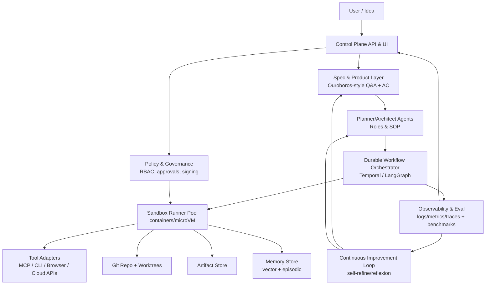
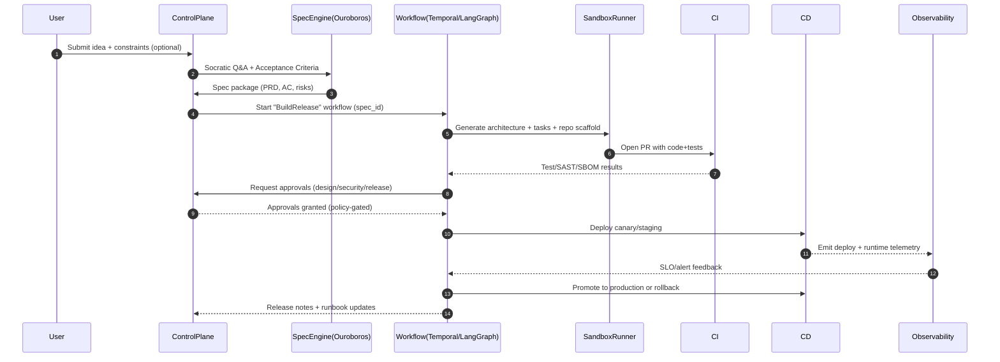
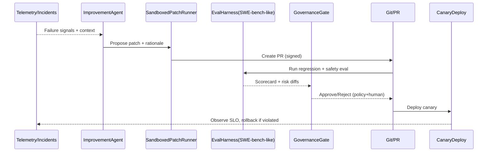

# 완전 자율·상시 운영형 AI 소프트웨어 개발 시스템 설계 심층 연구 보고서

## 요약

본 보고서는 “사용자의 프로그램 아이디어”를 입력으로 받아 **조사→명세→구현→테스트→배포→운영/모니터링→지속적 자가개선(자가수정 포함)**까지 수행하는 **상시(24/7) 자율형 AI 시스템**의 설계 원칙과 구체 아키텍처를 제안한다. 핵심 전제는 “완전 자율”이 곧 “무제한 권한”을 의미하지 않으며, **자가수정·도구 실행·외부접속·배포**가 결합될 때 공격 표면이 급격히 확대된다는 점이다. citeturn5search3turn21view0turn5search18

조사 결과, 사용자가 우선순위로 언급한 생태계(“Claw 계열”)는 서로 보완적인 참조 패턴을 제공한다. 예를 들어, **OpenClaw**는 “Gateway WS 컨트롤 플레인(세션/프레즌스/설정/크론/웹훅/콘솔 UI/Canvas)” 형태의 장수명 제어면 아키텍처를 제공하고 citeturn15view3turn11view0turn5search3, **Pi**는 최소 도구(기본 `read/write/edit/bash`)와 “SDK로 앱에 내장/또는 RPC 모드”라는 경량 코딩 에이전트/런타임 모델을 제공한다. citeturn2view1turn2view0 **Mini-Claw**는 Telegram↔봇↔Pi 세션과 로컬 JSONL 세션 저장으로 “지속 대화”의 최소 구현을 보여준다. citeturn15view1 **NanoClaw**는 “컨테이너 격리 + Claude Agent SDK 기반”을 전면에 둔 보안 우선 최소 코드베이스 접근을 제시한다. citeturn4search3turn4search2 **NullClaw**는 단일 Zig 바이너리(초소형·초저메모리·빠른 부팅)와 “명시적 allowlist + 다중 샌드박스(landlock/firejail/bwrap/docker)”를 통해 엣지/임베디드까지를 상정한다. citeturn3view1turn8search2turn8search3 **Claw-Empire**는 로컬-퍼스트 대시보드(단일 UI에서 여러 에이전트/프로바이더 오케스트레이션)와 “격리된 git worktree 협업”, “SQLite 기반 로컬 저장”, “OAuth 토큰 AES-256-GCM 암호화” 같은 운영/보안 구현 디테일을 제공한다. citeturn15view2

또한 **Ouroboros(Q00/ouroboros)**는 “코드 작성 이전에 소크라테스식 질문/온톨로지 분석으로 명세를 검증”하고, 더블 다이아몬드(탐색→정의→설계→검증) 프로세스를 플러그인/도구로 체계화한다. citeturn12view0turn30search10 **Gastown**은 다중 코딩 에이전트 협업 시 “재시작 때 문맥 손실”을 git-backed hooks/ledger로 해결하고, 데몬/워치독 체인으로 건강도를 유지하는 운영 패턴을 제공한다. citeturn13view1 **gstack**은 스프린트 라이프사이클(Think→Plan→Build→Review→Test→Ship→Reflect)을 명령(슬래시 커맨드)과 산출물 흐름으로 표준화하고, 엔지니어링 리뷰를 필수 게이트로 둔 점이 설계 거버넌스에 직접적 힌트를 준다. citeturn13view2turn13view3

본 보고서의 권고안은 위 패턴을 합성해, (1) **상시 운영을 위한 “내구 실행(durable execution)” 기반 워크플로 오케스트레이션**, (2) **에이전트 실행의 OS/컨테이너/마이크로VM 샌드박스 격리**, (3) **도구·리소스 접근의 정책 집행(Policy-as-Code) + 감사추적(서명/증적)**, (4) **자가개선은 ‘안전한 표면’(프롬프트/정책/스킬/구성)부터 자동화하고, ‘코드/모델 가중치’ 자가수정은 엄격한 평가·승인·롤백 거버넌스를 전제**로 한다. citeturn11search0turn8search0turn8search5turn7search2turn7search0

명시되지 않은 제약(목표 플랫폼, 예산, 관할 법령/규제, 데이터 민감도, 팀 규모)은 **오픈 조건**으로 가정하며, 설계에서는 (a) 개인-단일 사용자 로컬 퍼스트, (b) 팀/조직 단위, (c) 고규제 산업(금융/의료 등)까지 확장 가능한 선택지를 병렬 제시한다. citeturn5search3turn29view0turn19search9

## 시스템 목표와 위협 모델

본 절은 “무엇을 최적화할 것인가(목표)”와 “무엇이 실패할 수 있는가(위협 모델)”를 먼저 고정해, 이후 아키텍처·파이프라인·거버넌스 결정의 기준으로 삼는다.

**상위 목표(시스템이 달성해야 하는 것)**  
시스템은 사용자가 제시한 아이디어를 출발점으로, 요구사항을 명확화하고(질문/검증), 코드·문서·테스트·배포 아티팩트를 생성하며, 릴리즈 후 운영 데이터를 기반으로 반복 개선한다. 이때 “자율성”은 (i) 장시간 작업의 연속성, (ii) 멀티에이전트 병렬화, (iii) 환경과 상호작용(도구 호출/코드 실행/브라우저 자동화), (iv) 산출물 품질의 자기검증에 의해 정의된다. 이러한 설계 사상은 명세 우선의 Ouroboros가 강조하는 “입력(명세) 품질이 산출 품질을 지배”한다는 관찰과 정합적이다. citeturn12view0

**비목표(현실적 경계를 명확화)**  
“한 개의 공유된 에이전트/게이트웨이를 적대적 다중 사용자(서로 신뢰하지 않는 사용자) 환경의 보안 경계로 사용하는 것”은 목표에서 제외하는 것이 합리적이다. OpenClaw 문서가 **개인 비서 신뢰 모델(단일 신뢰 경계)**을 전제로 하며, 적대적 사용자 격리가 필요하면 경계를 분리(게이트웨이·자격증명·가능하면 OS 사용자/호스트 분리)하라고 명시한다. citeturn5search3

**자산(보호해야 할 것)**  
(1) 비밀정보(토큰, OAuth 리프레시 토큰, SSH 키, 클라우드 자격증명), (2) 사용자 데이터(대화, 파일, 이메일/메신저), (3) 소스코드/빌드 아티팩트/서명, (4) 배포 인프라(클러스터 권한, 레지스트리), (5) 정책·감사 로그(규정 준수 증적), (6) 모델/프롬프트/스킬 공급망이 핵심 자산이다. OpenClaw/Claw-Empire는 특히 메시징 채널+도구권한 결합을 전제로 하므로, 비밀정보·채널 접근권한이 1차 표적이 된다. citeturn5search3turn15view2

**공격자·오용 시나리오(Threat Actors)**  
(가) 외부 공격자: 웹/메신저를 통해 프롬프트 인젝션, 링크/파일을 통한 악성 지시 삽입, MCP/스킬 공급망을 통한 악성 도구 주입. citeturn5search18turn21view0turn4search2  
(나) 악의적 사용자/대화 참여자: 그룹 채팅 등에서 에이전트에게 “같은 도구 권한”으로 행동하도록 유도(권한 전이). OpenClaw는 “여러 비신뢰 사용자가 하나의 tool-enabled agent에 메시지 가능하면, 그들은 사실상 동일한 도구 권한을 공유”한다고 경고한다. citeturn5search3  
(다) 내부자/운영자 실수: 잘못된 배포, 시크릿 노출, 정책 우회.  
(라) 모델 자체의 오작동/기만: 장기 목표/자기보존형 행동, 평가 우회, “정렬 위장(alignment faking)” 류의 거동. citeturn9search29

**공격 표면(Attack Surface)**  
(1) 장수명 게이트웨이/컨트롤 플레인(WebSocket/REST), (2) 코드 실행 도구(쉘, 파이썬), (3) 브라우저 자동화, (4) MCP 서버 및 외부 API, (5) 스킬/플러그인/프롬프트 패키지(Supply chain), (6) CI/CD 권한(레포 쓰기/배포 토큰), (7) 자가수정 루프(자기 코드 변경)가 상호 결합될 때 위험이 증폭된다. OpenClaw는 게이트웨이가 세션/설정/크론/웹훅 등을 관장하는 컨트롤 플레인임을 명시해 이 표면을 뚜렷하게 보여준다. citeturn15view3turn11view0

**실증적 경고 신호(사례 기반 위험)**  
OpenClaw 생태계에서는 “악성 스킬” 및 “Cross-Site WebSocket Hijacking” 취약점(CVE-2026-25253)이 보고되었고, 특정 버전에서 패치되었다는 보고가 있다. 이는 (i) 스킬 공급망이 공격 벡터가 되며, (ii) 컨트롤 플레인 노출/CSWSH류 이슈가 게이트웨이 탈취로 이어질 수 있음을 시사한다(해당 이슈 내용은 ‘보고’로서의 성격이 강하므로, 설계 근거는 ‘가능한 위협’으로 취급하는 것이 안전하다). citeturn21view0  
또한 Snyk의 분석은 “스킬/에이전트 생태계가 기존 패키지 생태계(npm 등)와 유사한 공급망 리스크를 갖고, 개인 데이터 접근+비신뢰 콘텐츠 노출+외부 통신이 결합될 때 위험이 높아진다”는 점을 강조한다. citeturn5search18

**위협 모델링 프레임워크 선택**  
AI/에이전트 위협 분류에는 entity["organization","MITRE","nonprofit research org"]의 ATLAS와 같은 분류체계를 참고할 수 있고, OpenClaw 자체 문서도 MITRE ATLAS를 기반으로 한 위협 모델을 제공한다. citeturn11view3turn11view0 실무적으로는 “소프트웨어 실행층(샌드박스/시크릿/네트워크) + 에이전트 인지층(프롬프트 인젝션/목표 변질) + 정보시스템층(로그/권한/거버넌스)”을 동시에 다루는 다층 모델이 필요하다. citeturn5search26turn7search2

## 관련 프로젝트 및 도구 비교

본 절은 사용자가 지정한 프로젝트(우선순위 목록)와 “동일 문제를 푸는 다른 역사적/현행 프레임워크”를 비교해, 어떤 설계 요소를 차용할지 결정할 근거를 제공한다.

### 우선순위 프로젝트·생태계 비교 표

| 대상 | 핵심 아이디어/범위 | 설계에 주는 시사점 | 주요 리스크/한계 |
|---|---|---|---|
| OpenClaw | Gateway WS 컨트롤 플레인이 세션/프레즌스/설정/크론/웹훅/Control UI/Canvas를 관리하고, CLI 표면과 Pi 런타임을 결합하는 개인 비서 플랫폼. citeturn15view3turn5search3 | “컨트롤 플레인(장수명) + 에이전트 런타임(가변)” 분리, 세션/작업/스케줄/웹훅을 1차 구성요소로 모델링. OpenClaw의 개인-단일 신뢰 경계 가정은 멀티테넌시 설계 시 ‘반드시 경계 분리’가 필요함을 암시. citeturn5search3 | 스킬/플러그인 공급망 리스크 및 게이트웨이 노출 위험이 존재(보고 기반). citeturn21view0turn5search18 |
| Pi | 최소 코딩 하네스: 기본 4도구(`read/write/edit/bash`), 인터랙티브/JSON/RPC/SDK(내장) 모드, 확장은 TS 확장/스킬/템플릿/패키지로. citeturn2view1turn2view0turn2view2 | “작게 시작(최소 도구) + 확장은 패키지화”가 장기 안정성/감사 가능성에 유리. 내장(SDK) 모델은 게이트웨이/컨트롤 플레인과 결합하기 좋음. citeturn2view0turn2view1 | 최소주의는 고기능(서브에이전트/플랜 모드 등) 요구에 직접 대응하지 않으므로, 계층화(상위 오케스트레이터+하위 최소 런타임)가 필요. citeturn2view1turn17view0 |
| Mini-Claw | Telegram 봇 + Pi 세션, 로컬 JSONL로 세션 지속, “구독 기반(Claude/ChatGPT)으로 API 비용 회피”를 강조. citeturn15view1turn15view0 | “지속 대화/세션 저장”의 최소 구현과 비용 모델(구독 vs API)을 보여줌. 프로토타입(MVP) 출발점으로 적합. citeturn15view0 | 보안 격리·권한 제어는 최소 구현 수준이므로, 상시 운영/자가수정에는 별도 통제면이 필수. citeturn5search3turn8search15 |
| NanoClaw | 컨테이너 격리(세션/에이전트 단위), Claude Agent SDK 기반, “Programmatic tool calling(로컬 실행으로 민감 데이터 전송 최소화)”를 강조. citeturn4search3turn4search2 | “보안은 애플리케이션 체크가 아니라 OS 격리로”라는 강한 메시지. 자율·상시 에이전트의 기본값을 ‘샌드박스’로 두는 설계에 정합. citeturn4search2turn8search0turn8search5 | OS/컨테이너 제약(플랫폼 제한)과 격리 비용(운영 복잡도)이 증가. citeturn4search0turn8search15 |
| NullClaw | Zig 단일 바이너리(초소형/초저메모리/초고속), 다중 샌드박스(landlock/firejail/bwrap/docker), 다수 프로바이더/채널/메모리 엔진을 “vtable 인터페이스로 교체 가능”하게 설계. citeturn3view1turn8search2turn8search3 | 엣지/임베디드까지 포함하는 “초경량 컨트롤 플레인/런타임”의 가능성. “교체가능한 인터페이스”는 벤더 락인 및 안전성(권한별 런타임 분리)에 유리. citeturn3view1 | 초경량은 개발 생산성과 트레이드오프. 플랫폼 기능이 많아질수록 Zig/저수준 구현 난이도↑. citeturn3view1turn11search0 |
| Claw-Empire | 로컬-퍼스트 “에이전트 오피스” 대시보드: 여러 CLI/OAuth/API 에이전트를 한 UI에서 운영, SQLite 로컬 저장, git worktree 격리 협업, OAuth 토큰 AES-256-GCM 암호화(브라우저에 리프레시 토큰 비노출). citeturn15view2 | 운영관점(가시화/대시보드/토큰 보관/격리된 worktree)의 구체 구현 예시. “로컬-퍼스트 + 암호화 저장 + UI 투명성”은 자율 시스템의 신뢰 기반에 중요. citeturn15view2 | 로컬-퍼스트는 단일 머신/소규모에 최적. 조직형 확장에는 RBAC/분산 로그/정책 집행이 추가로 필요. citeturn7search0turn7search2 |
| Gastown | 다중 코딩 에이전트 협업 워크스페이스 매니저: 재시작 시 문맥 손실을 git-backed hooks/ledger로 해결, 20~30 에이전트 규모까지 확장, 데몬-워치독 체인으로 건강도 유지. citeturn13view1 | “에이전트 상태는 LLM 컨텍스트가 아니라 git/구조화된 ledger에 저장”해야 상시 운영이 가능. 워치독 체인은 자동 복구(runbook 자동화)의 출발점. citeturn13view1 | 워크스페이스/레포 중심이라, 제품 운영(프로덕션 모니터링/배포)까지 포함하려면 CI/CD·관측성 통합이 필요. citeturn11search0turn12view3 |
| gstack | Claude Code를 “가상 엔지니어링 팀(CEO/EM/QA/보안/릴리즈 등)” 역할로 분해하고, 스프린트 프로세스를 명령/산출물 흐름으로 정착(Eng review 게이트 포함). citeturn13view2turn13view3 | “역할 기반 체크리스트 + 산출물 연계”는 자가개선·자가수정 거버넌스에 즉시 적용 가능(예: 자동 PR은 `/review`·`/qa` 게이트 통과 시만). citeturn13view3 | 특정 도구(Claude Code) 전제의 워크플로 성격이 강해, 멀티 모델·멀티 런타임 시스템에서는 추상화 계층이 필요. citeturn12view3turn17view0 |
| Ouroboros (Q00) | “Stop prompting. Start specifying.”: 소크라테스식 질문·온톨로지 분석으로 명세를 먼저 검증(더블 다이아몬드), Claude Code 플러그인 형태. citeturn12view0 | 상시 자율 시스템에서 가장 중요한 실패점은 “잘못된/불명확한 목표”이므로, 명세-우선 모듈을 핵심 엔진으로 채택할 가치가 큼. 릴리즈 노트에서 QA 도구/정체 감지/체크포인트 복구 등 운영성 개선이 관찰됨. citeturn12view0turn30search10 | 명세는 품질의 필요조건이지만 충분조건이 아님. 구현/보안/운영 파이프라인과 결합해야 실제 릴리즈까지 이어짐. citeturn11search0turn5search18 |

### 범용 에이전트/개발 에이전트 프레임워크 비교 표

| 범주 | 후보 | 강점(공식 주장/특징) | 적합한 역할 |
|---|---|---|---|
| 오케스트레이션(상태ful) | LangGraph | “장수명·상태ful 에이전트”, durable execution, human-in-the-loop, 메모리·디버깅·배포를 공식적으로 강조. citeturn17view0 | 상시 워크플로(장기 작업/재시작 복구), 승인 지점(HITL) 삽입, 상태 머신/그래프 기반 파이프라인 |
| 멀티에이전트 프레임워크 | AutoGen | 다중 에이전트 앱 프레임워크, 레이어드 설계(Core/AgentChat/Extensions), 툴(Studio/Bench) 제공을 강조. citeturn18view0 | 팀형 에이전트 협업 패턴, 프로토타이핑, 에이전트 성능 벤치마킹(프레임워크 레벨) |
| 멀티에이전트(프로세스 중심) | CrewAI | LangChain 독립, “Crews/Flows”로 오케스트레이션+저수준 커스터마이즈를 강조. citeturn18view2 | 업무 프로세스(역할/태스크 YAML)로 빠르게 팀 구성, PoC→프로덕션 이전 단계 |
| 문서/지식 작업 | LlamaIndex | 문서 에이전트/agentic OCR 플랫폼(LlamaParse 등)과 워크플로/에이전트 빌더를 강조. citeturn18view4 | 요구분석·리서치·문서 QA, 제품 지식/레포 지식 RAG |
| “AI 소프트웨어 회사” 패턴 | MetaGPT | “1줄 요구→유저 스토리/경쟁분석/요구/데이터구조/API/문서” 산출, PM/아키텍트/엔지니어 등 역할+SOP를 내장. citeturn18view5 | 스프린트/회사형 SOP 템플릿(설계 문서·업무 분업) |
| 자율 개발 에이전트 플랫폼 | OpenHands | 코드 수정/CLI/웹 브라우징 등 “사람 개발자처럼” 수행 + 샌드박스 안전 실행 + 멀티에이전트/평가 통합을 논문/플랫폼에서 강조. citeturn19search13turn19search3 | 실제 “레포 작업(이슈 해결/PR)” 자동화 런타임, 대규모 병렬 실행 |
| SW 엔지니어링 벤치마크 | SWE-bench | 실제 GitHub 이슈/PR 기반 패치 생성 성능을 테스트(Verified/Lite/Multilingual 등)하며 리더보드 제공. citeturn19search6turn19search18turn19search12 | 자동 PR/패치 품질 평가, 회귀 방지, 자가개선 성능 지표 표준화 |

위 표는 전체 시스템이 “하나의 프레임워크”로 완결되기 어렵다는 결론을 지지한다. 상시 자율 시스템은 최소한 (1) 내구 실행/워크플로, (2) 샌드박스 실행, (3) 도구·지식 통합, (4) 평가·관측, (5) 거버넌스가 각각 독립 축으로 성숙해야 하며, 이를 단일 라이브러리가 모두 제공하는 경우는 드물다. citeturn11search0turn8search15turn17view0turn7search2

## 상세 아키텍처

이 절은 “모듈, 데이터 흐름, 인터페이스/API, 저장소, 모델 라이프사이클, HITL 지점”을 하나의 참조 설계로 묶는다. 설계 목표는 **(a) 연속 실행 가능성, (b) 안전한 도구 사용, (c) 검증 가능한 자가개선**이다.

### 참조 아키텍처 개요

아키텍처는 크게 6개 층으로 나눈다: **입력/제어면 → 명세/기획 → 실행/빌드 → 릴리즈/운영 → 관측/평가 → 거버넌스**. OpenClaw의 “Gateway 컨트롤 플레인” 개념은 첫 번째 층(입력/제어면)의 좋은 참조이며 citeturn15view3turn11view0, NanoClaw/NullClaw의 “OS 수준 격리”는 실행/빌드 층의 기본값을 강화한다. citeturn4search2turn8search0turn3view1

아래 다이어그램은 “컨트롤 플레인(항상 켜짐)”과 “실행 워커(격리된 단위)”를 분리하고, 모든 행동을 **워크플로(내구 실행) + 이벤트 로그**로 묶는다.



### 모듈 정의와 책임 분해

**컨트롤 플레인(Control Plane)**  
- 역할: 사용자 입력 수집, 상태/작업 목록, 승인(Approve) 인터페이스, 긴급정지(kill-switch), 운영 지표 뷰. OpenClaw는 게이트웨이를 WS 컨트롤 플레인으로 두고 세션/프레즌스/설정/크론/웹훅과 Control UI/Canvas를 제공한다고 밝힌다. citeturn15view3turn11view0  
- 인터페이스: (a) 사용자 UI/CLI, (b) 워크플로 오케스트레이터 API, (c) 에이전트 상태 스트림(WS/SSE), (d) 감사로그/정책 엔진.

**명세/제품 레이어(Spec & Product Layer)**  
- 역할: 아이디어를 “검증 가능한 명세(acceptance criteria, non-goals, constraints)”로 변환. Ouroboros는 ‘프롬프트’가 아니라 ‘명세’를 만들기 위해 소크라테스식 질문과 온톨로지 분석을 수행한다고 설명한다. citeturn12view0  
- 산출물: PRD, 사용자 스토리, 데이터 모델, API 계약(OpenAPI), 테스트 기준(AC), 리스크 레지스터.

**계획/아키텍처 에이전트(Planner/Architect Agents)**  
- 역할: 기능 분해(WBS), 리스크·에지케이스, 테스트 계획, 비용/일정 추정. gstack은 `/plan-eng-review`에서 아키텍처·데이터 흐름·다이어그램·테스트를 “숨은 가정이 드러나게” 잠그는 것을 목표로 하며, 산출물을 다음 단계(/qa)가 자동 재사용한다고 명시한다. citeturn13view3  
- 구현 방식: “역할 기반 SOP(CEO/EM/QA/보안/릴리즈)” 템플릿을 기본 제공하되, 실제 실행은 워크플로 엔진이 상태/단계를 관리한다. citeturn13view2turn11search0

**워크플로 오케스트레이터(Durable Workflow Orchestrator)**  
- 역할: 장기/반복 작업을 **내구 실행**으로 실행(재시작·크래시·재시도·스케줄). Temporal은 워크플로/스케줄/크론을 포함한 내구적 실행 개념을 공식 문서로 제공한다. citeturn11search0turn11search4  
- 대안: LangGraph도 “durable execution”과 “human-in-the-loop”을 명시적으로 지원한다고 밝힌다. citeturn17view0  
- 설계 원칙: “모든 자율 행동은 워크플로 인스턴스(런)로 식별되고, 입력/도구 호출/산출물/평가가 이벤트로 기록”되어야 한다(재현성·감사·롤백을 위해).

**샌드박스 러너(Sandbox Runner Pool)**  
- 역할: 에이전트가 생성한 코드/명령/브라우저 작업을 “호스트로부터 격리”하여 실행. NanoClaw가 컨테이너 격리를 핵심 차별점으로 내세우고 citeturn4search2turn4search3, Claude Code도 샌드박스가 “파일시스템/네트워크 격리”를 제공한다고 설명한다. citeturn8search15  
- 기술 선택지:  
  - gVisor: 컨테이너를 “애플리케이션 커널”로 샌드박스(컨테이너 탈출 리스크 감소) citeturn8search0  
  - Firecracker: 마이크로VM(낮은 오버헤드로 VM 수준 격리) citeturn8search5turn8search33  
  - Landlock/bubblewrap: 비특권 프로세스의 self-sandboxing(리눅스) citeturn8search2turn8search3turn8search18  

**도구/지식 어댑터(Tool Adapters)**  
- 역할: Git, CI, 브라우저, 클라우드 API, 사내 시스템 등을 표준 인터페이스로 노출. MCP는 “LLM 애플리케이션과 통합을 표준화하는 개방형 프로토콜”이라고 정의된다. citeturn1search1turn1search0turn1search2  
- 원칙: 도구는 (a) 최소 권한, (b) 입력 검증, (c) 실행 전후 감사, (d) 외부 통신 제한(allowlist)로 감싼다.

### 데이터 흐름과 저장소 설계

**상태 저장(Work state)**  
- “상태=LLM 컨텍스트”가 아니라 “상태=외부화된 구조 데이터”가 되어야 한다. Gastown은 재시작 시 문맥 손실을 git-backed hooks/ledger로 해결한다고 밝힌다. citeturn13view1  
- 권고:  
  1) 코드/문서: Git(메인 레포)  
  2) 작업 단위: 이슈/태스크(구조화 JSON/YAML) + 이벤트 로그(append-only)  
  3) 실행 격리: git worktree(Claw-Empire의 “격리된 worktree 협업” 패턴) citeturn15view2  

**메모리/지식 저장**  
- 단기 메모리: 실행 런의 working set(요약/핵심 사실/제약)  
- 장기 메모리: 벡터/키-값/문서 인덱스(“왜 결정을 했는지” 포함)  
- 주의: 메모리는 프롬프트 인젝션·데이터 오염의 통로가 되므로, “출처·신뢰도·만료(Decay)·격리(프로젝트/테넌트)” 메타데이터가 필수다. citeturn5search18turn7search3

**시크릿 저장**  
- Claw-Empire는 OAuth/메신저 토큰을 SQLite에 저장하되 AES-256-GCM으로 암호화하고, 브라우저에 리프레시 토큰을 주지 않는다고 명시한다. citeturn15view2  
- 이를 일반화해: (a) 시크릿은 반드시 전용 시크릿 스토어(또는 HSM/KMS)에 보관, (b) 샌드박스 러너에는 단기 임시 자격증명만 주입, (c) 런 종료 시 파기.

### 모델 라이프사이클(선정·배치·교체·평가)과 HITL 지점

**모델 라우팅/멀티프로바이더**  
- Pi는 다중 프로바이더 LLM API와 런타임 패키지 구조를 공개하고(OpenAI/Anthropic/Google 등 통합 API) citeturn2view2turn2view0, OpenClaw는 Pi를 SDK 방식으로 내장하여 “provider-agnostic model switching” 등을 제공한다고 설명한다. citeturn2view0  
- 권고: “라우터 모델(저비용) + 워커 모델(고성능) + 검증 모델(보수적)”의 3계층을 두고, 작업 성격에 따라 선택한다.

**HITL(사람 개입) 지점(권고 최소 집합)**  
LangGraph가 “인간이 중간에 상태를 검사/수정”할 수 있는 human-in-the-loop를 장점으로 명시하고 citeturn17view0, gstack은 Eng Review를 필수 게이트로 둔다. citeturn13view3 이를 바탕으로, 아래 이벤트는 최소 1인 승인(또는 2인 승인)을 요구하는 것이 안전하다:  
- 외부 네트워크 신규 도메인 접근 허용(allowlist 변경)  
- 새로운 스킬/도구 설치(공급망 입력)  
- 프로덕션 배포/롤백  
- 시크릿 범위 확대(새 OAuth scope, 신규 클라우드 권한)  
- 자가수정(코어 로직/권한/정책 변경)  
- 사용자 데이터 보관/삭제 정책 변경(법/윤리 영향) citeturn5search3turn29view0turn7search2  

## 컴포넌트 설계 옵션, 트레이드오프, 권고안

이 절은 시스템을 구성하는 주요 컴포넌트별로 “선택지→트레이드오프→권고”를 제시한다. 결론적으로, **내구 실행 + 샌드박스 격리 + 정책 집행 + 평가 게이트**의 조합이 자가수정까지 포함한 상시 자율 시스템의 최소요건에 가깝다. citeturn11search0turn8search15turn7search2

### 오케스트레이션 엔진

- **Temporal**: 워크플로/스케줄/크론을 포함한 내구 실행 모델을 공식 문서로 제공하며, 장기 실행과 재시도/복구에 강한 선택이다. citeturn11search0turn11search4  
- **LangGraph**: 에이전트를 그래프 형태로 구성하면서 durable execution·human-in-the-loop·메모리·배포를 강조한다. “에이전트가 장시간 실행되고 상태를 유지”해야 한다는 요구에 직접 부합한다. citeturn17view0  
- **Argo Workflows**: Kubernetes CRD 기반 컨테이너 워크플로 엔진으로 병렬 잡 오케스트레이션에 강점. citeturn11search1turn11search5  

**권고**:  
- “업무 프로세스(제품 스프린트) + 장기 실행 + 사람 승인”이 핵심이라면 LangGraph 또는 Temporal을 1차 권고한다. citeturn17view0turn11search0  
- 대규모 배치/데이터 파이프라인 중심이면 Argo Workflows를 결합(특히 모델 평가·대량 테스트에서 유리)한다. citeturn11search1turn19search2  

### 에이전트 런타임(코딩/도구 호출)

- **Pi 내장형 런타임**: OpenClaw는 Pi를 subprocess/RPC가 아니라 SDK로 임베드하고, 세션 라이프사이클/이벤트 핸들링, 커스텀 도구 주입, 시스템 프롬프트 커스터마이즈, 세션 브랜칭/컴팩션 등을 제공한다고 설명한다. citeturn2view0  
- **Claude Code/Agent SDK 기반 런타임**: Claude Code는 샌드박싱을 포함하고, NanoClaw는 Claude Agent SDK 위에서 “컨테이너 격리”를 핵심으로 둔다. citeturn8search15turn4search2turn4search3  
- **OpenHands**: 논문 및 플랫폼 설명에서 “샌드박스 안전 실행”과 “멀티에이전트/평가 통합”을 강조한다. citeturn19search13turn19search3  
- **SWE-agent 계열**: “실제 GitHub 이슈를 자율적으로 수정”하는 목적형 에이전트로 포지셔닝. citeturn19search1turn19search8  

**권고(실무적)**:  
- MVP는 **Pi 계열(최소 도구) + 명세/오케스트레이션 계층** 조합이 구현 복잡도 대비 효과가 크다. citeturn2view1turn12view0  
- 조직형/대규모 자동 PR 처리에는 OpenHands/SWE-agent 같은 “레포 작업 특화 런타임”을 워커로 붙이고, 컨트롤 플레인에서 정책/승인을 통제하는 방식이 합리적이다. citeturn19search13turn19search1turn5search3  

### 도구 통합 프로토콜

- **MCP**: 도구를 표준화해 “모델/에이전트가 바뀌어도 도구 통합을 재사용”하게 한다는 점이 핵심 이점이다. citeturn1search1turn1search2  

**권고**: 내부/외부 도구를 원칙적으로 MCP로 래핑하고, 정책 엔진이 MCP 서버 등록/권한을 통제하도록 한다. 특히 공급망 공격 보고에서 MCP backdoor가 언급되는 만큼, MCP 서버는 “서명/출처/권한”이 필수 메타데이터가 되어야 한다. citeturn21view0turn5search18

### 샌드박스 격리(보안 기본값)

- gVisor는 컨테이너를 샌드박스하기 위해 시스템 인터페이스를 “애플리케이션 커널”로 옮겨 컨테이너 탈출 위험을 줄인다고 설명한다. citeturn8search0  
- Firecracker는 마이크로VM을 빠르게 띄우며(공식 사이트는 짧은 시작시간을 강조), 컨테이너보다 강한 격리 경계를 제공하도록 설계됐다. citeturn8search5turn8search33  
- Landlock은 “scoped access-control(샌드박싱)”을 목표로 하며, 비특권 프로세스에서도 쓸 수 있는 최소 공격 표면을 강조한다. citeturn8search2  
- Claude Code는 샌드박스가 파일시스템/네트워크 격리를 제공하여 “매 명령마다 권한 프롬프트를 덜어주면서도 경계를 upfront로 설정”한다고 설명한다. citeturn8search15  

**권고(단계적)**:  
1) MVP: 컨테이너(Docker/Podman) + 네트워크/FS allowlist + 시크릿 최소 주입  
2) 프로덕션: gVisor 또는 Firecracker로 격리 경계 강화(특히 멀티테넌트/외부 입력이 많은 경우) citeturn8search0turn8search5turn5search3  
3) 엣지/로컬 퍼스트: Landlock/bubblewrap 기반 self-sandbox(리눅스)로 가벼운 격리 추가 citeturn8search2turn8search3  

### 운영 UI/가시화

- Claw-Empire는 픽셀 오피스 UI로 “오케스트레이션을 재미있고 투명하게” 만들고, 단일 대시보드에서 다양한 에이전트/프로바이더를 관리한다고 설명한다. citeturn15view2  
- OpenClaw Office 역시 게이트웨이를 통해 에이전트 협업 상태/툴 호출/리소스 소비를 “디지털 트윈 오피스”로 시각화하는 프론트엔드로 소개된다. citeturn5search9  

**권고**: 상시 자율 시스템은 디버깅·감사·신뢰를 위해 “상태 가시화”가 필수이므로, 초기부터 최소 수준의 Control UI(런 목록/도구 호출/PR/배포 상태)를 제공하고, 픽셀 오피스/디지털 트윈 뷰는 운영 성숙도에 따라 추가한다. citeturn15view3turn5search9turn15view2

## CI/CD·테스트·릴리즈·모니터링·롤백·지속 자가개선 파이프라인

본 절은 “코드 생성”이 아니라 “릴리즈 엔지니어링” 전체가 자동화 대상임을 전제로 한다. gstack이 스프린트를 “Think→Plan→Build→Review→Test→Ship→Reflect”로 정식화한 것도 같은 맥락이다. citeturn13view2

### 아이디어→릴리즈 파이프라인(시퀀스)



이 파이프라인은 **명세(AC)→PR→CI→승인→카나리→프로모션/롤백**을 표준 경로로 만든다. “승인 단계”는 gstack의 Eng Review 필수 게이트, OpenClaw의 개인 신뢰 경계 가정, 그리고 AI RMF/ISO 42001이 요구하는 책임/정책/검증의 원칙과 조화된다. citeturn13view3turn5search3turn7search2turn7search0

### 테스트 전략(레벨별)

- **단위(유닛) 테스트**: 기능 회귀의 1차 방어선. gstack은 테스트 비중을 강조하고, OpenClaw/NullClaw도 테스트 수치/스위트가 강조되는 사례가 관찰된다. citeturn13view2turn3view1  
- **통합 테스트**: MCP 서버/외부 API 스텁·레코딩 기반.  
- **E2E(브라우저 포함)**: gstack이 `/qa`에서 실제 브라우저를 열어 검사하는 패턴을 제시한다. citeturn13view3  
- **보안 테스트**: 공급망(SBOM), 시크릿 스캔, 정책 위반(allowlist) 테스트를 CI 게이트에 포함.

### 릴리즈/배포/롤백

- **GitHub Actions 기반 CI**는 워크플로 자동화를 위한 표준 선택지이며 공식 문서에서 워크플로 구문/자동화를 제공한다. citeturn16search15  
- **GitOps 기반 CD(예: Argo CD)**는 선언적 배포와 UI를 제공한다. citeturn16search16turn11search25  
- **롤백**은 “이전 릴리즈로 즉시 되돌아갈 수 있는 배포 단위(이미지/차트/매니페스트)”와 “데이터 마이그레이션의 롤포워드/롤백 전략”을 함께 설계해야 한다(특히 자가수정이 DB 스키마까지 변경할 수 있으므로).

### 지속 자가개선(Continuous Improvement) 루프

자가개선은 두 층으로 구분하는 것이 안전하다.

**층 A: ‘언어/정책/절차’ 기반 개선(저위험 자동화)**  
- Reflexion은 “가중치 업데이트 없이, 언어적 피드백을 에피소드 메모리에 저장해 다음 시도 의사결정을 개선”하는 프레임워크를 제안한다. citeturn6search0turn6search12  
- Self-Refine은 “동일 LLM이 output에 피드백을 주고 스스로 개선”하는 반복 refinement를 제안한다. citeturn6search1turn6search13  
- 권고: 운영 중 발생한 실패(테스트 실패, 알럿, 사용자 불만)에 대해 **(1) 원인 요약→(2) 재발 방지 규칙(스킬/프롬프트/체크리스트) 업데이트→(3) 시뮬레이션 재실행**을 자동화하고, 이 변경은 기본적으로 자동 머지 가능(단, 정책 변경은 승인 필요)로 둔다. citeturn7search2turn13view3

**층 B: 코드/시스템 자가수정(고위험, 강거버넌스)**  
- 코어 코드 변경은 반드시 “샌드박스에서 패치 생성→전체 회귀 테스트→보안 스캔→카나리→프로모션”을 통과해야 하며, 변경 범위(권한/시크릿/네트워크)는 사람 승인 또는 다중 승인으로 제한한다. OpenClaw는 CODEOWNERS 보안 경로를 함부로 수정하지 말고 ‘제한된 표면’으로 취급하라고 안내한다. citeturn5search1turn5search8  
- 스킬 공급망 공격(보고)과 같은 사례는 “자가수정이 곧 공급망 입력을 늘린다”는 점을 보여주므로, 코드 서명·프로비넌스·SBOM을 병행해야 한다. citeturn21view0turn15view2turn6search3

자가개선 파이프라인(고위험 루프)은 다음처럼 정의할 수 있다.



## 안전·보안·법·윤리·거버넌스 통제

이 절은 “샌드박스/접근제어/감사추적/설명가능성/킬스위치/업데이트 거버넌스”를 요구사항으로 풀어낸다. 결론적으로, 상시 자율 시스템은 **DevSecOps + AIMS(ISO 42001) + AI RMF**의 결합 대상으로 보는 것이 현실적이다. citeturn7search0turn7search2

### 샌드박싱과 권한 경계

- OpenClaw는 개인 비서 모델(단일 신뢰 경계)을 전제로 하며, 적대적 다중 사용자 격리를 원하면 ‘별도 게이트웨이+자격증명+가능하면 OS 사용자/호스트 분리’를 권고한다. citeturn5search3  
- Claude Code는 샌드박스가 OS primitives로 FS/네트워크 격리를 제공한다고 설명한다. citeturn8search15  
- gVisor/Firecracker/Landlock/bubblewrap은 각기 다른 수준의 격리 경계를 제공하므로, “작업 위험도”에 따라 런너 등급을 나누는 것이 바람직하다. citeturn8search0turn8search5turn8search2turn8search3  

**권고(실행 등급)**  
- L0(읽기 전용): 문서/리서치(네트워크 제한, 파일 읽기 제한)  
- L1(로컬 계산): 샌드박스 파이썬/노드(외부 통신 제한)  
- L2(코드 변경): git worktree + 제한된 툴(커밋은 PR로만)  
- L3(배포): CD 토큰 접근(다중 승인+카나리)  
- L4(자가수정): 정책/권한/코어 변경(최고 등급 승인+외부 감사로그)

### 접근제어, 감사추적, 공급망 보안

- OpenClaw는 보안 경로를 CODEOWNERS로 보호하고, 에이전트/리뷰어가 함부로 수정하지 말 것을 강조한다. citeturn5search1turn5search8  
- SLSA는 소프트웨어 공급망 보안 수준을 단계적으로 정의하는 표준화 노력이며(사양/레벨 정의), citeturn16search0 Sigstore는 소프트웨어 서명(예: cosign)과 검증을 위한 생태계를 제공한다. citeturn16search1  
- SPDX/CycloneDX는 SBOM 표준으로 공급망 가시성을 강화한다. citeturn16search3turn16search4  

**권고**:  
1) 모든 PR/릴리즈 아티팩트에 서명(Sigstore) + SBOM 생성(SPDX 또는 CycloneDX)  
2) “스킬/도구/MCP 서버”도 동일하게 “서명/버전/출처/권한”을 메타데이터로 등록  
3) 정책 변경은 “정책 리포지토리”에서 코드리뷰·서명·승인 후 배포

### 프롬프트 인젝션·스킬 오염·도구 포이즈닝 대응

- Snyk 분석은 스킬 생태계의 공급망 리스크와 에이전트가 가진 위험한 결합(민감 데이터 접근 + 비신뢰 입력 + 외부 통신)을 강조한다. citeturn5search18  
- OpenClaw 생태계에서 악성 스킬/CSWSH 취약점 보고가 있었고, 이는 “컨트롤 플레인 보호(바인딩, 노출 최소화, 버전 패치)”와 “스킬 검증”이 필수임을 시사한다. citeturn21view0turn5search3  

**권고(핵심 통제)**  
- 컨트롤 플레인은 기본값 “localhost 바인딩 + 인증/페어링 + 외부 노출 금지”  
- 스킬 설치는 (a) 정적 스캔, (b) 실행 권한 선언(manifest), (c) 서명 검증, (d) 샌드박스에서만 테스트 후 활성화  
- MCP 서버는 네트워크·파일 접근 범위를 정책으로 제한하고, 데이터 유출 탐지(egress DLP)를 둔다

### 법·윤리·규제 대응

- 한국 개인정보보호 체계에서는 개인정보 처리의 적법성·안전조치·목적 제한 등이 핵심이며, 개인정보보호위원회는 생성형 AI 개발·활용을 위한 개인정보 처리 안내서(목록 공지)를 통해 생성형 AI 생애주기 내 개인정보 처리 쟁점을 다룬다고 밝힌다. citeturn22view0  
- EU의 AI 규제는 세계법제정보센터에 영문/번역본 링크가 제공되며(법적 효력 자체는 공식 원문 확인 필요), AI 시스템의 위험 기반 규제 프레임을 제공한다. citeturn29view0  
- entity["organization","NIST","us standards institute"]의 AI RMF 1.0과 생성형 AI 프로파일(NIST AI 600-1)은 생성형 AI의 위험 범주(프라이버시/정보보안/IP/정보무결성 등)를 포괄적으로 정리한다. citeturn7search2turn7search3turn7search12  
- entity["organization","ISO","standards org"]의 ISO/IEC 42001은 조직이 AI 관리시스템(AIMS)을 구축·유지·지속 개선하도록 요구/가이드를 제공하는 최초의 글로벌 표준으로 소개된다. citeturn7search0turn7search4  

**권고(오픈 조건 하의 최소 준수 전략)**  
- “관할/데이터 민감도/배포 지역”이 미정인 상황에서는, AI RMF(위험 식별·측정·관리) + ISO 42001(AIMS) + ISO 27001(ISMS)을 상위 거버넌스 프레임으로 두고, 지역별(한국 PIPA, EU AI Act 등) 요구를 프로파일로 매핑하는 접근이 안전하다. citeturn7search2turn7search0turn7search1turn29view0

### 킬 스위치·운영 거버넌스

- 즉시 정지: 모든 워크플로/러너를 중지하고 시크릿을 회수(토큰 무효화)  
- 안전 모드: 네트워크 차단 + 읽기 전용 + 사람 승인 없이는 어떤 외부 액션도 금지  
- 업데이트 거버넌스: “정책/권한/배포”는 항상 별도 승인 경로(CODEOWNERS/2인 승인)로 처리. OpenClaw가 보안 경로를 “제한 표면”으로 취급하라고 명시한 점은, 자가수정 거버넌스의 기본 원칙으로 재사용 가능하다. citeturn5search1turn5search8

## 평가 지표·배포 시나리오·비용 추정·운영 런북·로드맵

### 평가 지표와 벤치마크

**기능/품질 지표**  
- 명세 적합도: AC 충족률, 스펙 변경률(릴리즈 후 요구 재해석 빈도)  
- 코드 품질: 테스트 통과율, 커버리지, 린트/타입체크, 결함 밀도(릴리즈 후 버그)  
- 리뷰 품질: 자동 리뷰 지적의 처리율(미해결 코멘트 비율), gstack식 “review readiness” 대시보드처럼 게이트 통과 여부를 명시화 가능. citeturn13view3

**에이전트 성능 지표(자율성/안정성)**  
- 작업 성공률(정의된 목표 달성)  
- 평균 완료 시간/비용(토큰, 러너 시간)  
- 정체(stall) 비율, 자동 복구 성공률: Ouroboros 릴리즈 노트의 “stall detection & supervisor recovery” 같은 운영성 기능이 참고 사례다. citeturn30search10  
- 장기 실행 안정성: Gastown의 워치독 체인/헬스 유지 패턴이 참고된다. citeturn13view0turn13view1

**표준 벤치마크 매핑(권고)**  
- SWE-bench(Verified/Lite/Multilingual): “실제 GitHub 이슈 패치” 성능 및 회귀 검증에 사용. citeturn19search6turn19search18turn19search22  
- AgentBench: 에이전트형 작업(대화형 환경) 성능 평가. citeturn6search3turn6search11  
- 컴퓨터 사용/브라우징형 평가는 OSWorld 등 벤치마크가 주요 모델 릴리즈에서 언급되며, 실제 브라우저 자동화(/qa) 패턴과 결합 가능하다. citeturn10search7turn13view3  

### 배포 시나리오와 확장성

**시나리오 A: 개인 로컬-퍼스트(단일 사용자)**  
- OpenClaw/Claw-Empire/Mini-Claw 스타일. 로컬 저장(SQLite/파일), 제한된 외부 연결, 개인 권한. citeturn15view2turn15view0turn5search3  
- 장점: 데이터 통제, 비용 예측(구독/로컬 모델).  
- 주의: 개인 환경이라도 스킬/도구 공급망 리스크는 그대로이며, 컨트롤 플레인 외부 노출 금지가 중요하다. citeturn21view0turn5search3  

**시나리오 B: 팀 단위(프로젝트별 신뢰 경계 분리)**  
- OpenClaw 문서의 권고대로 “신뢰 경계(팀/프로젝트)별 게이트웨이/자격증명 분리”가 필요. citeturn5search3  
- 워크플로/샌드박스는 Kubernetes로 스케일 아웃, CI/CD는 GitOps.

**시나리오 C: 대규모/엔터프라이즈**  
- OpenHands는 “1→수천 에이전트” 스케일을 강조하며, 샌드박스 런타임·감사 가능성을 언급한다. citeturn19search3turn19search0  
- 요구: 중앙 정책·감사·데이터 거버넌스(ISO 42001/27001, AI RMF 매핑). citeturn7search0turn7search1turn7search2  

### 비용 추정(범위)과 비용 모델

비용은 크게 **(1) 모델 토큰 비용, (2) 샌드박스/CI 실행 비용, (3) 저장/관측 비용**으로 나뉜다. 모델 비용은 공급자 가격표에 직접 의존하며, 예를 들어 Anthropic은 Opus 4.6이 “$5/MTok 입력, $25/MTok 출력”, Sonnet 4.6이 “$3/MTok 입력, $15/MTok 출력”이라고 명시한다. citeturn10search2turn10search8turn10search10 OpenAI 쪽은 모델별 토큰 단가를 모델 문서/가격 페이지에서 제공한다. citeturn9search36turn9search0

**예시적 월간 토큰 비용(작업량 민감; 참고 값)**  
- 소규모(개인/PoC): 월 입력 50M, 출력 10M 토큰(대화+코딩+테스트 로그 포함)  
  - Sonnet 4.6 기준 ≈ 50×$3 + 10×$15 = $150 + $150 = **$300/월** citeturn10search8turn10search10  
- 중간(팀/상시 CI): 월 입력 500M, 출력 100M  
  - Sonnet 4.6 기준 ≈ **$3,000/월**(입력) + **$1,500/월**(출력) = **$4,500/월** citeturn10search8turn10search10  
- 대규모(다중 프로젝트/수십 에이전트): 월 입력 2B, 출력 400M  
  - Sonnet 4.6 기준 ≈ 2,000×$3 + 400×$15 = **$6,000 + $6,000 = $12,000/월** citeturn10search8turn10search10  

**샌드박스/인프라 비용(대략)**  
- 클라우드 GPU/호스팅 비용은 지역/인스턴스에 따라 달라지며, AWS는 SageMaker 예시에서 ml.g5.2xlarge LLM hosting 시간당 비용을 제시한다(예시 표). citeturn9search38  
- Google Cloud도 GPU 가격표를 별도로 제공하며 스팟/온디맨드 등 모델을 구분한다. citeturn9search3  

**해석**: 상시 자율 개발 시스템은 “토큰 비용 + 샌드박스 실행”이 지배적이며, 자가개선이 적극적일수록(자동 E2E/리그레션/브라우징) 토큰과 실행시간이 함께 증가한다. 따라서 (a) 캐싱/배치(공급자 제공 할인), (b) 저비용 라우팅 모델, (c) 작업 단계별 컨텍스트 축약/컴팩션이 비용 최적화의 핵심이다. citeturn10search10turn10search0turn2view1turn2view0

### 운영 런북(핵심 시나리오)

**정상 운영(일일/주간)**  
- 런 대시보드 확인: 실패 런/재시도/정체 탐지(워치독) citeturn13view0turn30search10  
- 의존성/스킬 업데이트: 서명 검증 후 샌드박스에서 테스트→프로덕션 반영  
- 시크릿 회전: OAuth/클라우드 키 정기 회전, 최소 스코프 검토 citeturn15view2turn5search3  
- 평가 리그레션: SWE-bench Lite/내부 회귀 스위트 정기 실행 citeturn19search12  

**사고 대응(알럿/침해 의심)**  
1) 즉시 kill-switch → 네트워크 차단/토큰 회수  
2) 감사로그/런 이벤트 재현(샌드박스 재실행)  
3) 영향 범위(데이터/레포/배포) 산정 후 롤백  
4) 패치 PR 생성(자가개선 루프는 이 시점엔 ‘자동 머지 금지’)  
5) 포스트모템: 규칙/정책 업데이트(Self-Refine/Reflexion 층 A로 흡수) citeturn6search0turn6search1turn7search2  

### 연구 공백과 로드맵

**핵심 연구 공백**  
- “프롬프트 인젝션/도구 포이즈닝”의 정량 평가와 표준 방어선(공급망 포함)은 아직 빠르게 진화 중이며, 실제 사례(악성 스킬 보고)가 이를 뒷받침한다. citeturn5search18turn21view0  
- “장기 자율 에이전트” 평가 벤치마크는 SWE-bench/AgentBench 등으로 확장되고 있으나, 프로덕션 운영(롤백/거버넌스/법 준수)을 포함한 종단 평가 기준은 부족하다. citeturn19search6turn6search3turn6search19  
- 자가수정의 안전성: 언어 기반 개선(Self-Refine/Reflexion)은 유망하지만, 시스템/권한/정책까지 포함한 자가수정은 강거버넌스 없이는 위험하다. citeturn6search0turn6search1turn7search0turn7search2  

**권고 로드맵(예시 타임라인; 제약 오픈 조건)**  
- MVP(4–8주):  
  - 명세 우선 엔진(Ouroboros 패턴) + 단일 레포 PR 생성 + CI 통과 + 스테이징 배포 + 기본 관측. citeturn12view0turn13view3turn16search15  
  - 샌드박스(컨테이너) 기본값 + 최소 권한(도구 allowlist) citeturn8search15turn8search0  
- 베타(8–16주):  
  - 멀티에이전트 병렬화(역할/SOP), git worktree 격리, 워치독/정체 복구(Gastown/Ouroboros 패턴) citeturn13view1turn30search10turn15view2  
  - 서명/SBOM/프로비넌스 도입(SLSA/Sigstore) citeturn16search0turn16search1turn16search3  
- 프로덕션(16주+):  
  - 카나리/자동 롤백 + 자가개선 루프(층 A 자동, 층 B 승인 기반)  
  - ISO 42001/AI RMF 프로파일 기반 거버넌스(정책/감사/리스크 레지스터) citeturn7search0turn7search2turn7search3  

### 참고 링크 모음

```text
OpenClaw (core): https://github.com/openclaw/openclaw
OpenClaw Docs: https://docs.openclaw.ai/
OpenClaw Pi integration doc: https://github.com/openclaw/openclaw/blob/main/docs/pi.md

Pi monorepo: https://github.com/badlogic/pi-mono
Pi coding-agent README: https://github.com/badlogic/pi-mono/blob/main/packages/coding-agent/README.md

Mini-Claw: https://github.com/htlin222/mini-claw
NanoClaw: https://github.com/qwibitai/nanoclaw
NullClaw: https://github.com/nullclaw/nullclaw
Claw-Empire: https://github.com/GreenSheep01201/claw-empire

Ouroboros (spec-first): https://github.com/Q00/ouroboros
Gastown: https://github.com/steveyegge/gastown
gstack: https://github.com/garrytan/gstack

Model Context Protocol (MCP): https://modelcontextprotocol.io/
Claude Code Docs: https://code.claude.com/
OpenAI Codex CLI Docs: https://developers.openai.com/codex/cli/  (참고용)

SWE-bench: https://www.swebench.com/
AgentBench: https://openreview.net/forum?id=zAdUB0aCTQ

NIST AI RMF 1.0: https://nvlpubs.nist.gov/nistpubs/ai/nist.ai.100-1.pdf
NIST GenAI Profile (AI 600-1): https://nvlpubs.nist.gov/nistpubs/ai/NIST.AI.600-1.pdf
ISO/IEC 42001 overview: https://www.iso.org/standard/42001

EU AI Act (WorldLII mirror / KR legal portal): https://world.moleg.go.kr/web/wli/lgslInfoReadPage.do?AST_SEQ=93&CTS_SEQ=51409
```