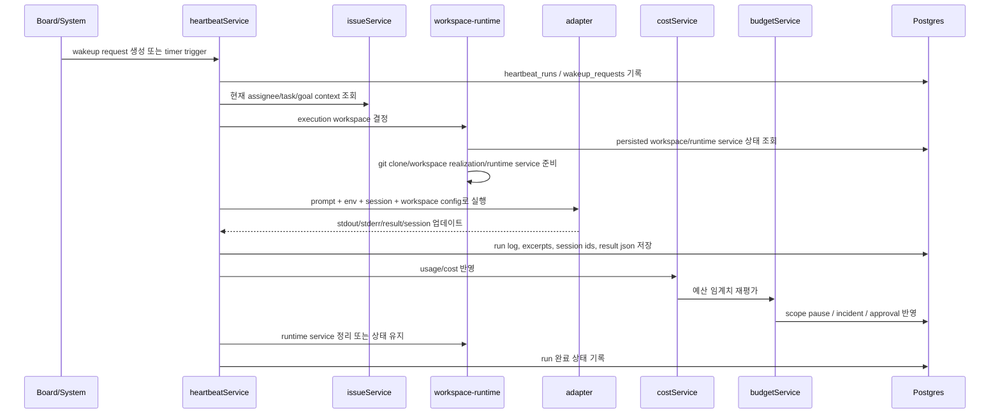
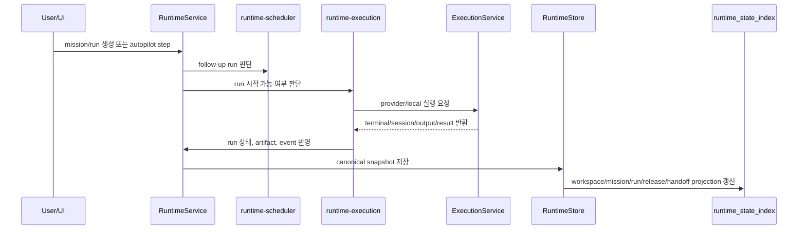

# Paperclip Heartbeat 분석과 UCM 비교

## 목적

이 문서는 `paperclipai/paperclip`의 heartbeat 실행 경로를 정리하고, 현재 `ucm` 데스크톱 런타임 구조와 직접 비교하기 위한 참고 문서다.

비교의 초점은 두 가지다.

1. Paperclip의 heartbeat가 실제로 어떤 순서로 동작하는지 파악한다.
2. 그 구조가 현재 `ucm`의 `mission/run/runtime` 모델과 어디서 겹치고 어디서 갈라지는지 정리한다.

이 문서는 기능 홍보가 아니라 런타임 설계 비교를 위한 기술 메모다.

## 분석 대상

- Paperclip
  - 제품 성격: "AI 회사 운영용 control plane"
  - 기준 문서: `doc/SPEC-implementation.md`
  - 기준 코드: `server/src/services/heartbeat.ts`, `server/src/index.ts`, `packages/adapters/*`
- UCM
  - 제품 성격: "데스크톱 단일 제품 + workspace/mission/run 중심 로컬 오케스트레이션"
  - 기준 코드: `ucm-desktop/src/main/runtime.ts`, `runtime-execution.ts`, `runtime-scheduler.ts`, `runtime-store.ts`, `execution-service.ts`

## 한 줄 요약

Paperclip의 heartbeat는 "에이전트 한 번 깨우기"가 아니라 "task checkout, workspace 준비, runtime service 연결, adapter 실행, 로그/비용/세션 상태 기록, 후속 제어"를 하나의 durable run ledger로 관리하는 흐름이다.

반면 현재 `ucm`은 이미 `mission/run` 중심의 이벤트성 오케스트레이션 구조를 갖고 있지만, Paperclip처럼 별도의 wakeup queue, run ledger, budget/approval gate, runtime service lifecycle을 독립된 서브시스템으로 분리해 놓지는 않았다.

## Paperclip heartbeat 실행 흐름

### 핵심 역할

Paperclip에서 heartbeat는 아래 역할을 동시에 맡는다.

- 에이전트를 실행할 시점을 결정한다.
- 실행 단위를 `heartbeat_run`으로 기록한다.
- 실행 전 workspace와 runtime service를 준비한다.
- adapter를 통해 외부 에이전트를 호출한다.
- 실행 중 로그와 session 상태를 누적한다.
- 실행 후 결과, 비용, budget 영향, 다음 액션을 반영한다.

즉 heartbeat는 단순 cron callback이 아니라 "run orchestration transaction"에 가깝다.

### 주요 컴포넌트

- `server/src/index.ts`
  - 서버 부팅, DB 연결, 임베디드 Postgres, migration 적용
- `server/src/services/heartbeat.ts`
  - wakeup request, heartbeat run, workspace 준비, adapter 실행, 결과 기록
- `server/src/services/issues.ts`
  - task/issue 상태, assignee, goal 연계
- `server/src/services/budgets.ts`
  - cost 집계, hard-stop pause
- `server/src/services/workspace-runtime.ts`
  - execution workspace와 runtime service 준비/해제
- `packages/adapters/*`
  - Codex, Claude, Cursor, Gemini, OpenClaw 등 외부 런타임 연결

### 시퀀스

아래는 코드 기준으로 재구성한 heartbeat 실행 시퀀스다.

### 단계별 설명

#### 1. wakeup request 수집

heartbeat는 `timer`, `assignment`, `on_demand`, `automation` 같은 source로 시작할 수 있다. 시작점은 "agent를 실행해야 한다"는 intent이며, 그 intent는 wakeup request와 heartbeat run으로 분리 기록된다.

이 설계의 장점은 "왜 이 실행이 시작됐는가"를 run 이후에도 추적할 수 있다는 점이다.

#### 2. 실행 전 잠금과 동시성 제어

`heartbeat.ts`는 agent별 start lock을 두고, 동시 실행 수 상한도 별도로 둔다. 핵심은 "동일 agent의 중복 실행"과 "provider lane 포화"를 분리해서 다룬다는 점이다.

즉 실행 제한은 단일 boolean이 아니라 다음 층으로 나뉜다.

- agent start lock
- concurrent run cap
- sessioned adapter 집합
- budget enforcement

#### 3. issue 기준 실행 컨텍스트 구성

Paperclip에서 실제 업무 단위는 대화가 아니라 `issue`다. heartbeat는 assignee, project, goal, approval, previous session, workspace policy를 issue 기준으로 끌어온다.

이 단계에서 run은 이미 "무엇을 위해 실행되는가"가 정해진 상태가 된다.

#### 4. managed workspace 준비

`heartbeat.ts`는 project repo URL이 있으면 managed checkout 경로를 계산하고, 필요 시 `git clone`까지 수행한다. 기존 checkout이 이미 있으면 재사용하고, 비정상 디렉터리면 경고 후 그대로 사용한다.

핵심은 workspace 준비가 adapter 내부가 아니라 heartbeat orchestration 계층에 있다는 점이다.

이는 다음 판단을 중앙화한다.

- workspace path 정책
- clone timeout
- repo-only / managed checkout 구분
- project workspace와 agent home fallback

#### 5. runtime service realization

Paperclip는 workspace만 만드는 것이 아니라, run에 필요한 로컬 runtime service도 준비한다. 예를 들면 로컬 서버 포트, 서비스 베이스 env, adapter가 소비할 런타임 연결 정보가 여기에 해당한다.

즉 adapter는 "그냥 cwd 하나 받는 실행기"가 아니라, orchestration layer가 실현한 runtime context 위에서 동작한다.

#### 6. adapter 실행

adapter는 provider별 차이를 감싸는 플러그인처럼 동작한다. Codex 로컬 어댑터 문서를 보면 다음이 명확하다.

- stdin 기반 prompt 전달
- instructions file prepend
- repo AGENTS.md 자동 적용
- per-company `CODEX_HOME` 관리
- runtime skill injection
- workspace runtime env 주입

즉 Paperclip는 provider 호출을 "prompt 한 번 던지기"로 취급하지 않고, provider별 실행 환경 자체를 관리 대상으로 본다.

#### 7. 세션, 로그, 결과 누적

heartbeat run에는 다음 성격의 데이터가 붙는다.

- session id before / after
- stdout / stderr excerpt
- external run id / process pid
- result json / usage json
- log ref / compressed log / sha256
- process loss retry count
- context snapshot

이건 단순 실행 결과보다 "재개 가능한 런타임 흔적"에 가깝다.

#### 8. 비용 및 budget enforcement

Paperclip는 비용 기록을 후처리 부가 기능이 아니라 제어 흐름 일부로 둔다. cost event가 쌓이면 budget policy가 같은 UTC 월 윈도우 기준으로 평가되고, hard stop이면 company/project/agent scope를 pause 처리한다.

즉 budget은 관찰 지표가 아니라 runtime gate다.

#### 9. 후속 조치

heartbeat 이후엔 다음 일이 이어질 수 있다.

- issue 상태 업데이트
- approval 생성
- wakeup 재요청
- runtime service 정리 또는 유지
- live event publish

이로써 Paperclip의 heartbeat는 한 번 실행하고 끝나는 콜백이 아니라, 다음 orchestration step을 남기는 루프가 된다.

## UCM 현재 실행 흐름

### 핵심 역할

현재 `ucm`은 `mission/run` 중심 런타임이다.

- `RuntimeService`
  - 상태 진입점, store read/write, workspace discovery, autopilot orchestration
- `runtime-execution.ts`
  - run 시작/완료, provider 선택, steering context, role contract 검증
- `execution-service.ts`
  - provider lane 관리, shell/provider 실행, terminal session, git diff 포착
- `runtime-scheduler.ts`
  - 후속 run 생성과 budget bucket 소모
- `runtime-store.ts`
  - snapshot 저장과 SQLite projection 갱신

즉 `ucm`도 이미 "mission snapshot 위에 follow-up run이 생기고, conductor/scheduler가 다음 단계를 연다"는 구조를 갖고 있다.

### UCM 실행 시퀀스

### 강점

- `mission/run/artifact/release/handoff` 개념이 이미 분리돼 있다.
- `runtime-conductor.ts`와 `runtime-scheduler.ts`가 후속 흐름을 코드상 명시한다.
- `runtime-store.ts`는 canonical snapshot과 SQLite projection을 함께 유지한다.
- `execution-service.ts`는 provider lane과 budget lane을 분리해 포화 상태를 관리한다.
- `packages/execution/runtime-engine.js`로 엔진 계층 분리 방향도 이미 있다.

### 현재 한계

- 실행 요청 자체를 durable queue나 wakeup request로 기록하지 않는다.
- 개별 run 실행 메타데이터가 snapshot 내부 이벤트에 비해 상대적으로 얇다.
- runtime service lifecycle이 독립 서브시스템으로 분리돼 있지 않다.
- cost/budget가 provider lane 제한 중심이며, 장기 누적 비용 정책까지는 아직 아니다.
- approval/governance가 release/handoff 중심이지, 실행 전 gate 모델로 일반화돼 있진 않다.

## Paperclip와 UCM의 직접 비교

### 1. 업무 단위

Paperclip는 `company -> goal -> project -> issue -> heartbeat_run`이다.

UCM은 `workspace -> mission -> run -> artifact/release/handoff`다.

차이는 명확하다.

- Paperclip는 조직 운영 모델이 먼저다.
- UCM은 사용자의 작업 수행 모델이 먼저다.

즉 Paperclip의 issue는 UCM의 mission 일부 역할을 하지만, company/governance 층까지 같이 끌고 온다.

### 2. 실행 트리거

Paperclip는 wakeup request가 독립 엔터티다.

- timer
- assignment
- on_demand
- automation

UCM은 현재 `RuntimeService`와 autopilot step이 직접 실행을 연다. trigger 원인은 이벤트로 남지만, 그 trigger를 별도 queue 객체로 다루지는 않는다.

평가:

- Paperclip 방식은 추적성과 재시도 정책이 강하다.
- UCM 방식은 단순하고 데스크톱 단일 사용자 환경에는 가볍다.

### 3. 실행 기록 밀도

Paperclip의 `heartbeat_run`은 실행 ledger다.

- before/after session
- process pid
- log ref
- usage json
- result json
- retry count
- context snapshot

UCM run은 더 제품 친화적이다.

- title
- status
- timeline
- decisions
- artifacts
- deliverables
- handoffs

평가:

- Paperclip는 운영/복구 관점에서 강하다.
- UCM은 사용자 이해도와 결과물 중심 UX에서 강하다.

권장 방향은 둘 중 하나를 버리는 것이 아니라, `UCM run = 사용자 모델`, `run execution ledger = 운영 모델`의 2층 구조를 두는 것이다.

### 4. workspace 모델

Paperclip는 heartbeat orchestration 계층이 workspace를 직접 실현한다.

- managed checkout
- repo clone
- runtime service env
- persisted execution workspace

UCM은 현재 workspace discovery와 execution workspace path 전달이 중심이다. `packages/execution/runtime-engine.js`에는 worktree manager가 있지만, 데스크톱 주 경로에서는 아직 Paperclip만큼 독립된 workspace runtime lifecycle로 정착된 상태는 아니다.

평가:

- UCM은 "선택된 로컬 작업공간에서 실행"에 강하다.
- Paperclip는 "프로젝트용 managed workspace를 시스템이 책임진다"는 점이 강하다.

### 5. 예산과 제어

Paperclip budget은 장기 누적 비용 정책이다.

- calendar month UTC
- warning / hard stop
- company/project/agent scope pause

UCM budget은 현재 run scheduling과 provider lane 점유 제한에 더 가깝다.

- mission budget bucket
- max open runs
- provider lane saturation

평가:

- UCM은 실행량 제어에는 충분하다.
- 장기 운영 비용 통제에는 아직 더 얇다.

### 6. 승인과 거버넌스

Paperclip는 approval이 전용 엔터티다. hire, strategy, budget incident 같은 행위가 approval gate 뒤에 올 수 있다.

UCM은 현재 release approval, steering, handoff가 런타임 흐름에 녹아 있다.

평가:

- Paperclip는 운영 제어판에 가깝다.
- UCM은 작업 결과 패키징과 인간 개입 UX에 더 집중돼 있다.

### 7. 저장소 설계

Paperclip는 Postgres + 세분화된 정규화 테이블 구조다.

UCM은 canonical snapshot + SQLite projection 구조다.

평가:

- Paperclip는 멀티테넌트, 감사 로그, 운영 통계에 유리하다.
- UCM은 데스크톱 로컬 앱에서 단순성, 복구, 이동성에 유리하다.

현재 UCM 목표를 고려하면 snapshot + projection 전략은 유지하는 편이 맞다. 다만 실행 ledger 성격의 projection을 추가하는 것은 충분히 가치가 있다.

## UCM에 가져올 만한 것

### 우선순위 높음

#### 1. wakeup request / run trigger ledger

현재 UCM에는 "왜 이 run이 지금 시작됐는가"를 별도 엔터티로 남기는 층이 약하다.

가져올 아이디어:

- `runtime_wakeup_request` 같은 로컬 SQLite 테이블 추가
- source: `manual | followup | approval | steering | automation`
- trigger detail, requestedBy, parent run/event id 저장

효과:

- 자동 진행 디버깅이 쉬워진다.
- 중복 실행과 재시도 정책을 분리하기 쉬워진다.

#### 2. run execution ledger 분리

현재 `RunDetail`은 사용자-facing 엔터티로 좋지만, 운영용 실행 흔적이 부족하다.

가져올 아이디어:

- `runtime_run_execution_index` 또는 `runtime_execution_attempt_index`
- attempt 단위로 provider, session, startedAt, finishedAt, stdoutExcerpt, stderrExcerpt, exitCode, workspacePath, worktreePath 저장

효과:

- UI용 run과 실제 실행 시도를 분리할 수 있다.
- provider 장애, queue 포화, 재시도 흔적을 복구하기 쉬워진다.

#### 3. workspace runtime lifecycle

Paperclip의 강점은 workspace와 runtime service를 orchestration layer가 책임진다는 점이다.

가져올 아이디어:

- run 시작 전 `workspace realization` 단계 추가
- worktree, local dev server, temp env, artifact staging path를 명시적 객체로 관리
- 완료 후 release/reuse/cleanup 정책 명문화

효과:

- 로컬 long-running app 작업에서 실행 일관성이 좋아진다.
- run마다 같은 준비 코드를 반복하지 않게 된다.

### 우선순위 중간

#### 4. cost policy와 runtime budget 분리

현재 UCM budget은 주로 scheduling pressure 제어다.

가져올 아이디어:

- 실행량 제어 budget과 비용 정책 budget을 분리
- provider 응답에서 토큰/비용 메타데이터를 표준 통계로 저장
- 월간 hard stop까지는 아니어도 session/mission/workspace 기준 누적 지표를 추가

#### 5. context snapshot 기록

run 시작 시점에 어떤 steering, artifact, workspace, role contract가 들어갔는지 스냅샷으로 남기면 재현성이 좋아진다.

### 우선순위 낮음

#### 6. approval 엔터티 일반화

현재 UCM은 release 승인 흐름에 강하다. 이걸 일반 approval framework로 넓히는 건 가능하지만, 지금 제품 범위에선 우선순위가 높지 않다.

## UCM에 그대로 가져오면 안 되는 것

### 1. company/org chart 중심 도메인

현재 UCM은 데스크톱 단일 제품이다. Paperclip의 company, membership, org tree, instance role 같은 구조를 그대로 들여오면 제품 중심이 흐려진다.

### 2. plugin platform 확장

Paperclip 실제 코드베이스는 plugin 관련 서비스가 이미 크게 자리 잡고 있다. 현재 UCM 단계에서 이 축을 가져오면 코어보다 주변 시스템이 먼저 커질 가능성이 높다.

### 3. Postgres 수준의 과한 정규화

UCM은 로컬 desktop app이므로 snapshot + projection이 맞다. 필요한 것은 DB 엔진 교체가 아니라 projection 종류 보강이다.

## 권장 구조 변화

### 제안 1. UCM run을 이중 구조로 나눈다

- 사용자 레이어
  - `Mission`
  - `Run`
  - `Artifact`
  - `Release`
  - `Handoff`
- 운영 레이어
  - `WakeupRequest`
  - `RunExecutionAttempt`
  - `WorkspaceLease`
  - `RuntimeServiceLease`

이렇게 두면 현재 UX 모델은 유지하면서, Paperclip식 실행 추적성만 흡수할 수 있다.

### 제안 2. `RuntimeService`에서 실행 시도 기록을 명시화한다

현재 `RuntimeService -> runtime-execution -> execution-service` 흐름은 좋다. 여기에 아래 레이어를 추가하면 된다.

1. trigger 기록
2. workspace realization 기록
3. provider execution attempt 기록
4. 결과 반영
5. follow-up scheduling

즉 지금 구조를 버릴 이유는 없고, 중간 ledger를 보강하면 된다.

### 제안 3. SQLite projection을 더 세분화한다

현재 projection:

- `runtime_workspace_index`
- `runtime_mission_index`
- `runtime_run_index`
- `runtime_release_index`
- `runtime_handoff_index`

추가 후보:

- `runtime_wakeup_request_index`
- `runtime_run_execution_index`
- `runtime_workspace_lease_index`
- `runtime_provider_lane_index`

## 최종 판단

Paperclip에서 가장 배울 만한 것은 "회사 메타포"가 아니라 heartbeat를 durable orchestration ledger로 다루는 방식이다.

현재 `ucm`은 이미 다음 기반을 갖고 있다.

- mission/run 중심 모델
- conductor/scheduler 분리
- canonical snapshot + projection
- provider lane 및 terminal session 관리

따라서 `ucm`은 Paperclip를 따라 새 제품으로 갈아엎을 필요가 없다. 대신 아래 세 가지만 선택적으로 흡수하는 편이 맞다.

1. 실행 trigger를 별도 엔터티로 기록하기
2. run execution attempt ledger를 도입하기
3. workspace/runtime service lifecycle을 명시적 객체로 승격하기

이 세 가지는 현재 `ucm` 아키텍처와 충돌하지 않고, long-running desktop orchestration의 복구력과 관측성을 바로 높여준다.

## 참고

- Paperclip repository: `https://github.com/paperclipai/paperclip`
- Paperclip 핵심 파일
  - `doc/SPEC-implementation.md`
  - `server/src/index.ts`
  - `server/src/services/heartbeat.ts`
  - `server/src/services/budgets.ts`
  - `packages/adapters/codex-local/src/index.ts`
- UCM 핵심 파일
  - `docs/architecture-redesign.md`
  - `ucm-desktop/src/main/runtime.ts`
  - `ucm-desktop/src/main/runtime-execution.ts`
  - `ucm-desktop/src/main/runtime-scheduler.ts`
  - `ucm-desktop/src/main/runtime-store.ts`
  - `ucm-desktop/src/main/runtime-state-index.ts`
  - `ucm-desktop/src/main/execution-service.ts`
