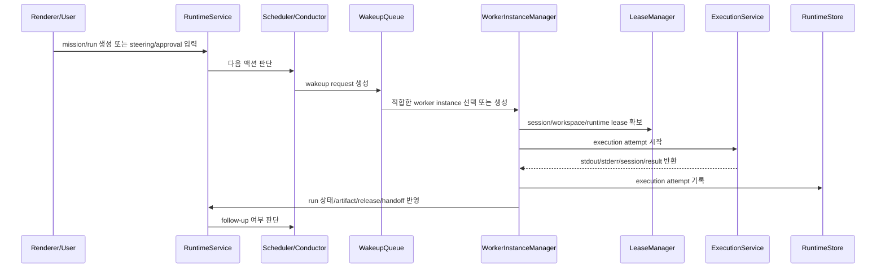

# Paperclip-Style Runtime Architecture for UCM

기준일: 2026-03-31

## 0. 목적

이 문서는 `ucm`이 현재의 `mission/run` 중심 런타임을 유지하면서도, 내부 실행 엔진은 Paperclip식 "장기 인스턴스 관리" 모델로 재구성하기 위한 아키텍처 초안이다.

핵심 목표는 세 가지다.

1. 실행 단위를 "한 번의 provider 호출"이 아니라 "지속 관리되는 worker instance"로 승격한다.
2. `mission/run/artifact/release/handoff` UX는 유지한다.
3. wakeup, execution attempt, session, workspace/runtime lease를 durable runtime 계층으로 분리한다.

이 문서는 제품 메타포를 회사 운영 모델로 바꾸려는 문서가 아니다. `ucm`의 표면 용어는 유지하고, 내부 runtime control plane만 강화하는 것이 목적이다.

## 1. 왜 이 방향인가

현재 `ucm`은 아래 강점이 있다.

- `workspace -> mission -> run -> artifact -> release -> handoff` 흐름이 명확하다
- conductor, scheduler, execution 계층이 이미 분리돼 있다
- snapshot + SQLite projection 구조가 데스크톱 제품과 잘 맞는다

하지만 현재 모델은 여전히 "run 중심"이다.

- run을 시작한 이유가 독립 엔터티로 남지 않는다
- 실제 provider 실행 시도가 별도 ledger로 분리되지 않는다
- 같은 provider/session/workspace를 장기적으로 운영하는 층이 얇다
- runtime service와 workspace 재사용이 정책 객체보다 호출 경로에 가깝다

앞으로 `ucm`이 원하는 것이 아래라면 이 구조는 더 강화되어야 한다.

- 같은 작업자를 오래 붙잡고 이어서 일시키기
- 같은 repo/workspace에서 반복 실행하기
- provider session을 재사용하고 회전 정책을 두기
- 실행 실패와 복구를 run 결과와 분리해 기록하기
- long-running app 작업에서 dev server와 부가 runtime을 유지하기

즉 방향은 "Paperclip의 회사 메타포"가 아니라 "Paperclip의 durable runtime model"을 가져오는 것이다.

## 2. 설계 원칙

### 2.1 표면 UX와 내부 runtime을 분리한다

사용자에게 보이는 1급 개념은 계속 아래를 유지한다.

- `Workspace`
- `Mission`
- `Run`
- `Artifact`
- `Release`
- `Handoff`

내부 runtime 계층은 별도 개념으로 분리한다.

- `WorkerInstance`
- `WakeupRequest`
- `ExecutionAttempt`
- `SessionLease`
- `WorkspaceLease`
- `RuntimeServiceLease`

즉 사용자는 계속 mission과 run을 본다. 하지만 시스템은 그 아래에서 장기 worker를 운영한다.

### 2.2 `Run`은 제품 객체로 남기고, 실제 실행은 `ExecutionAttempt`로 분리한다

`Run`은 여전히 계획과 결과를 담는 사용자 객체다.

- title
- summary
- artifacts
- decisions
- release
- handoff

반면 실제 실행은 `ExecutionAttempt`가 담당한다.

- 언제 시작됐는지
- 어떤 wakeup으로 시작됐는지
- 어떤 provider/model/session을 썼는지
- 어떤 cwd/worktree/lease를 붙였는지
- stdout/stderr excerpt와 종료 이유가 무엇인지

이 구조를 두면 "run은 하나인데 실행 시도는 여러 번"인 현실을 자연스럽게 표현할 수 있다.

### 2.3 session continuity와 run continuity를 분리한다

현재도 `run continuity != provider session continuity` 원칙은 맞다. 이 원칙은 유지한다.

하지만 장기 인스턴스 모델에서는 아래가 추가된다.

- 같은 `WorkerInstance`가 여러 `Run`을 처리할 수 있다
- 같은 `SessionLease`가 여러 `ExecutionAttempt`에서 재사용될 수 있다
- 같은 `WorkspaceLease`가 review, implementation, verification 실행을 이어받을 수 있다

즉 continuity는 하나가 아니라 세 층이다.

- 제품 연속성: mission/run
- 작업자 연속성: worker instance
- provider 연속성: session lease

### 2.4 snapshot + projection 전략은 유지한다

새 모델을 도입한다고 해서 Postgres식 정규화 모델로 갈 필요는 없다.

기준 저장소는 계속 아래로 유지한다.

- canonical snapshot: `runtime_state_store`
- query projection: `runtime_*_index`

필요한 것은 저장소 교체가 아니라 projection 종류 확장이다.

## 3. 목표 개념 모델

## 3.1 WorkerInstance

지속 관리되는 작업자 단위다.

```ts
type WorkerInstance = {
  id: string;
  workspaceId: string;
  missionId?: string;
  role: string;
  provider: "claude" | "codex" | "gemini" | "local";
  status: "idle" | "warming" | "running" | "queued" | "blocked" | "cooldown" | "expired";
  objective: string;
  sessionLeaseId?: string;
  workspaceLeaseId?: string;
  runtimeServiceLeaseIds: string[];
  affinityKey?: string;
  lastRunId?: string;
  lastAttemptId?: string;
  lastUsedAt: string;
};
```

의미:

- `Run`은 "할 일"이고 `WorkerInstance`는 "그 일을 수행하는 지속 작업자"다
- 한 mission 안에 여러 worker가 있을 수 있다
- worker는 같은 role/provider affinity를 유지할 수 있다

## 3.2 WakeupRequest

실행 요청을 durable하게 기록하는 객체다.

```ts
type WakeupSource =
  | "manual"
  | "automation"
  | "followup"
  | "approval"
  | "steering"
  | "retry"
  | "system";

type WakeupRequest = {
  id: string;
  workspaceId: string;
  missionId: string;
  runId: string;
  workerInstanceId?: string;
  source: WakeupSource;
  status: "queued" | "claimed" | "completed" | "cancelled" | "superseded";
  requestedAt: string;
  requestedBy?: "user" | "system" | "runtime";
  triggerEventId?: string;
  parentAttemptId?: string;
  reason?: string;
};
```

효과:

- 왜 실행됐는지 남는다
- 중복 실행과 재시도를 분리할 수 있다
- scheduler와 conductor가 직접 실행을 여는 대신, wakeup을 발행하는 구조로 바꿀 수 있다

## 3.3 ExecutionAttempt

실제 provider 실행 시도 레코드다.

```ts
type ExecutionAttempt = {
  id: string;
  workspaceId: string;
  missionId: string;
  runId: string;
  workerInstanceId?: string;
  wakeupRequestId?: string;
  attemptNumber: number;
  provider: "claude" | "codex" | "gemini" | "local";
  model?: string;
  status: "starting" | "running" | "succeeded" | "blocked" | "failed" | "cancelled" | "timed_out";
  startedAt: string;
  finishedAt?: string;
  sessionLeaseId?: string;
  workspaceLeaseId?: string;
  runtimeServiceLeaseIds?: string[];
  terminalSessionId?: string;
  exitCode?: number | null;
  stdoutExcerpt?: string;
  stderrExcerpt?: string;
  errorCode?: string;
  errorMessage?: string;
  estimatedPromptTokens?: number;
  outputChars?: number;
  latencyMs?: number;
  localityScore?: number;
};
```

이 객체는 사용자용 `RunDetail`을 대체하지 않는다. 대신 `RunDetail` 아래의 실행 면을 분리해서 관측성과 복구력을 높인다.

## 3.4 SessionLease

provider session 재사용을 durable하게 관리하는 객체다.

```ts
type SessionReusePolicy = "ephemeral" | "prefer_reuse" | "require_reuse";

type SessionLease = {
  id: string;
  provider: "claude" | "codex" | "gemini";
  workspaceId: string;
  workerInstanceId?: string;
  affinityKey?: string;
  sessionId?: string;
  sessionDisplayId?: string;
  status: "warm" | "busy" | "cooldown" | "expired";
  reusePolicy: SessionReusePolicy;
  lastAttemptId?: string;
  lastUsedAt: string;
  expiresAt?: string;
  rotationReason?: string;
};
```

원칙:

- 세션이 존재해도 run은 새로 열 수 있다
- run이 끝나도 세션은 유지될 수 있다
- provider별 native session 관리 능력을 반영해야 한다

## 3.5 WorkspaceLease

실행에 사용되는 작업공간 임대 단위다.

```ts
type WorkspaceLeaseMode = "attached_root" | "git_worktree" | "managed_checkout" | "ephemeral_copy";

type WorkspaceLease = {
  id: string;
  workspaceId: string;
  missionId?: string;
  mode: WorkspaceLeaseMode;
  rootPath: string;
  checkoutPath?: string;
  branchName?: string;
  baseRef?: string;
  status: "ready" | "busy" | "dirty" | "stale" | "released";
  ownerWorkerInstanceId?: string;
  lastAttemptId?: string;
  createdAt: string;
  updatedAt: string;
};
```

이 객체가 있으면 현재 scattered한 workspace/worktree 준비 로직을 정책 객체로 승격할 수 있다.

## 3.6 RuntimeServiceLease

장기 앱 작업에서 필요한 부가 런타임이다.

```ts
type RuntimeServiceLease = {
  id: string;
  workspaceId: string;
  missionId?: string;
  workerInstanceId?: string;
  kind: "dev_server" | "preview_server" | "test_watcher" | "custom";
  name: string;
  status: "starting" | "running" | "stopped" | "failed";
  command?: string;
  cwd?: string;
  port?: number;
  url?: string;
  lifecycle: "shared" | "ephemeral";
  healthStatus?: "unknown" | "healthy" | "unhealthy";
  lastHeartbeatAt?: string;
};
```

이 객체가 필요한 이유는 long-running app 작업에서 "앱이 이미 떠 있느냐"가 provider 실행만큼 중요하기 때문이다.

## 4. 목표 실행 흐름



이 흐름의 핵심은 `Scheduler`가 더 이상 직접 provider 실행을 열지 않는다는 점이다. Scheduler는 wakeup만 발행하고, worker/runtime layer가 실행을 책임진다.

## 5. 현재 코드와의 대응

### 5.1 유지할 것

- `RuntimeService`
  - 계속 상위 orchestrator로 유지
- `runtime-conductor.ts`
  - 여전히 후속 판단 엔진으로 유지
- `runtime-scheduler.ts`
  - wakeup 발행 엔진으로 축소/재정의
- `runtime-store.ts`
  - canonical snapshot + projection 저장 유지
- `execution-service.ts`
  - 실제 provider 실행 엔진으로 유지

즉 지금 구조를 버릴 필요는 없다. 다만 책임을 더 세분화하면 된다.

### 5.2 새로 필요한 계층

- `runtime-wakeup-service.ts`
  - wakeup request 생성, claim, complete
- `runtime-worker-service.ts`
  - worker instance 선택/생성/상태 전이
- `runtime-session-lease-service.ts`
  - provider session lease 관리
- `runtime-workspace-lease-service.ts`
  - workspace/worktree/checkout lease 관리
- `runtime-runtime-service-lease.ts`
  - dev server 등 장기 프로세스 관리
- `runtime-execution-attempts.ts`
  - execution attempt 기록/조회

## 6. SQLite projection 확장안

현재 projection:

- `runtime_workspace_index`
- `runtime_mission_index`
- `runtime_run_index`
- `runtime_release_index`
- `runtime_handoff_index`

추가 projection:

### 6.1 `runtime_worker_instance_index`

- `worker_instance_id`
- `workspace_id`
- `mission_id`
- `role`
- `provider`
- `status`
- `session_lease_id`
- `workspace_lease_id`
- `last_run_id`
- `last_attempt_id`
- `last_used_at`

### 6.2 `runtime_wakeup_request_index`

- `wakeup_request_id`
- `workspace_id`
- `mission_id`
- `run_id`
- `worker_instance_id`
- `source`
- `status`
- `trigger_event_id`
- `parent_attempt_id`
- `requested_at`

### 6.3 `runtime_execution_attempt_index`

- `attempt_id`
- `workspace_id`
- `mission_id`
- `run_id`
- `worker_instance_id`
- `wakeup_request_id`
- `provider`
- `model`
- `status`
- `session_lease_id`
- `workspace_lease_id`
- `terminal_session_id`
- `started_at`
- `finished_at`
- `exit_code`
- `latency_ms`
- `estimated_prompt_tokens`
- `output_chars`

### 6.4 `runtime_session_lease_index`

- `session_lease_id`
- `provider`
- `workspace_id`
- `worker_instance_id`
- `affinity_key`
- `session_id`
- `status`
- `reuse_policy`
- `last_attempt_id`
- `last_used_at`
- `expires_at`

### 6.5 `runtime_workspace_lease_index`

- `workspace_lease_id`
- `workspace_id`
- `mission_id`
- `mode`
- `root_path`
- `checkout_path`
- `branch_name`
- `status`
- `owner_worker_instance_id`
- `last_attempt_id`

### 6.6 `runtime_service_lease_index`

- `runtime_service_lease_id`
- `workspace_id`
- `mission_id`
- `worker_instance_id`
- `kind`
- `name`
- `status`
- `port`
- `url`
- `lifecycle`
- `health_status`

## 7. LLM 관리 모델

Paperclip식 장기 인스턴스 모델로 가려면 provider layer도 얇은 command wrapper에서 벗어나야 한다.

목표 provider 계약은 최소한 아래를 포함해야 한다.

- `execute`
- `createTerminalSession`
- `resumeSession`
- `rotateSession`
- `listModels`
- `detectCurrentModel`
- `testEnvironment`
- `getQuotaWindows`
- `supportsSessionReuse`
- `nativeContextManagement`

즉 provider는 단순 `prompt -> stdout` 함수가 아니라 "운영 가능한 runtime adapter"가 되어야 한다.

## 8. 단계별 마이그레이션

### Phase 1. ledger 추가

목표:

- 기존 UX를 안 건드리고, wakeup과 execution attempt만 추가

작업:

- `WakeupRequest`, `ExecutionAttempt` 타입 추가
- SQLite projection 2개 추가
- `runtime-scheduler.ts`가 직접 실행 대신 wakeup 생성하도록 변경
- `RuntimeService`가 wakeup claim 후 실행 시도를 기록

### Phase 2. worker instance 도입

목표:

- run과 지속 작업자 개념 분리

작업:

- `WorkerInstance` 타입과 projection 추가
- run 생성 시 role/provider affinity 기반 worker 연결
- 상태 전이를 `run.status`만이 아니라 `worker.status`로도 분리

### Phase 3. session/workspace lease 도입

목표:

- provider session과 workspace reuse를 durable하게 관리

작업:

- `SessionLease`, `WorkspaceLease` 도입
- `Cache-Local Execution` 스펙과 연결
- `execution-service.ts`가 direct cwd 전달 대신 lease 기반 실행으로 이동

### Phase 4. runtime service lease 도입

목표:

- long-running app 작업 지원 강화

작업:

- dev server/test watcher를 first-class runtime으로 승격
- 헬스체크와 재사용 정책 반영

## 9. 비목표

이 문서는 아래를 당장 하자는 문서가 아니다.

- company/org chart 도메인 도입
- approval framework 전면 일반화
- Postgres 기반 재구축
- plugin platform 도입
- web/cli 재활성화

## 10. 최종 판단

`ucm`이 앞으로 장기 작업자를 붙잡고 일시키는 데스크톱 control plane이 되려면, 현재의 `run 중심 모델`만으로는 부족하다.

가장 맞는 방향은 아래다.

- 표면은 계속 `mission/run/artifact/release/handoff`
- 내부는 `worker/wakeup/attempt/session/workspace/service lease`

즉 `ucm`은 Paperclip가 잘한 것을 가져오되, 회사 메타포는 버리고 런타임 모델만 번역해야 한다.

이 방향은 현재 `RuntimeService`, `ExecutionService`, `RuntimeStore`, `Cache-Local Execution` 설계와 충돌하지 않는다. 오히려 지금 이미 있는 분리선을 더 명확하게 만든다.

## 참고

- `docs/paperclip-heartbeat-ucm-comparison.md`
- `docs/cache-local-execution-spec.md`
- `docs/architecture-redesign.md`
- `ucm-desktop/src/main/runtime.ts`
- `ucm-desktop/src/main/runtime-execution.ts`
- `ucm-desktop/src/main/runtime-scheduler.ts`
- `ucm-desktop/src/main/runtime-store.ts`
- `ucm-desktop/src/main/execution-service.ts`
