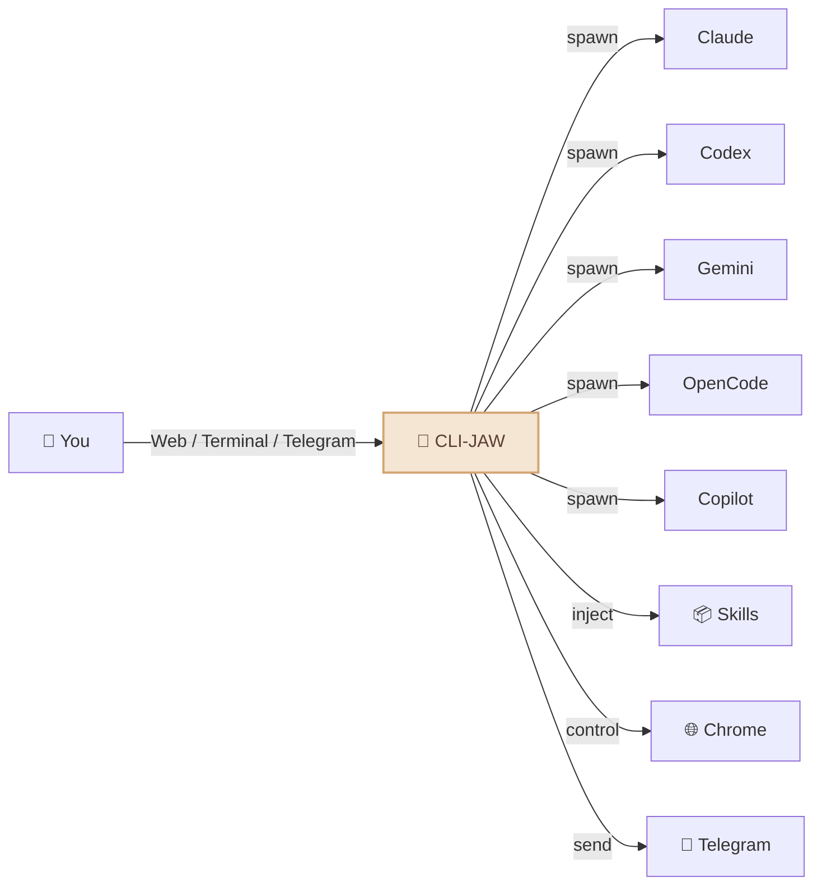
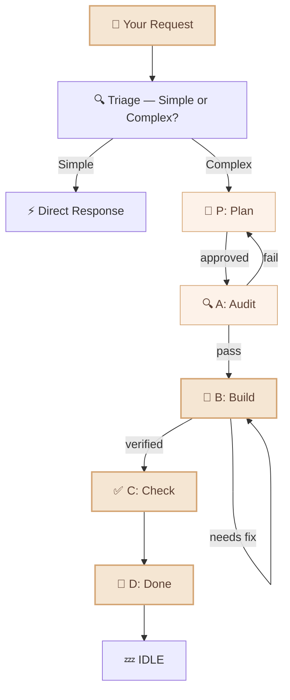
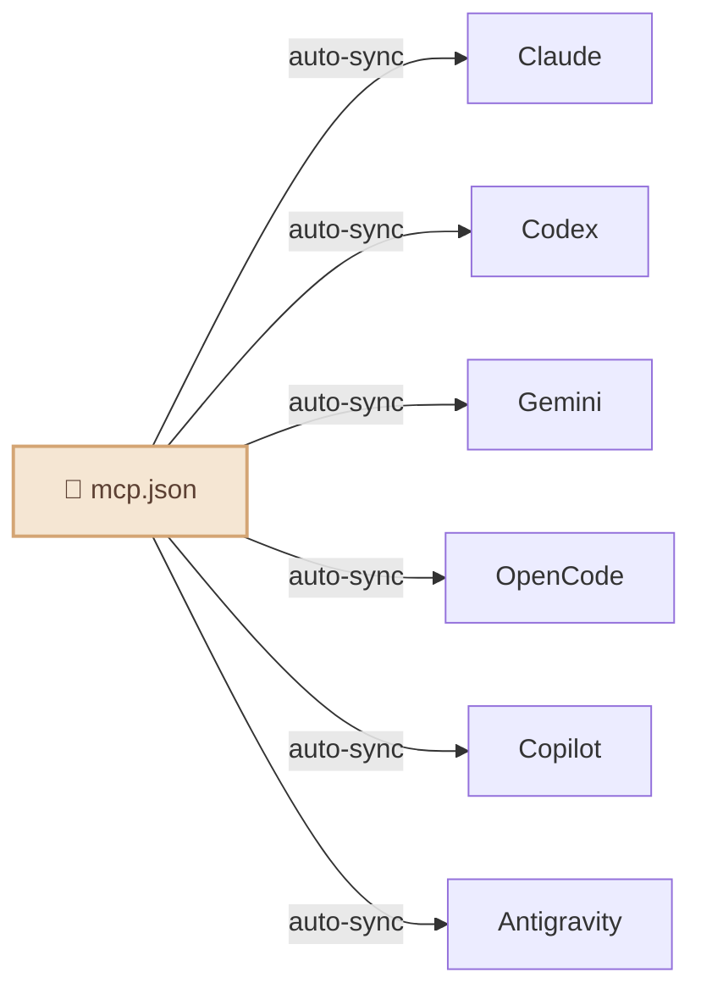

<div align="center">

# 🦈 CLI-JAW

### Your Personal AI Assistant — Powered by 5 AI Engines

*One assistant. Five brains. Always on.*

[](#-tests)
[](https://typescriptlang.org)
[](https://nodejs.org)
[](LICENSE)
[](https://npmjs.com/package/cli-jaw)
[](#-docker--container-isolation)
[](#)

**English** / [한국어](README.ko.md) / [中文](README.zh-CN.md)

<video src="https://github.com/user-attachments/assets/a7cf17c9-bfb3-44f0-b7fd-d001a39643fd" autoplay loop muted playsinline width="100%"></video>

</div>

<details>
<summary>🪟 <b>Are you on Windows?</b> — WSL One-Click Setup</summary>

**Step 1: Install WSL** (PowerShell as Admin — one time only)

```powershell
wsl --install
```

Restart your computer when prompted. After reboot, open **Ubuntu** from the Start Menu.

**Step 2: Install CLI-JAW** (in the Ubuntu/WSL terminal)

```bash
curl -fsSL https://raw.githubusercontent.com/lidge-jun/cli-jaw/master/scripts/install-wsl.sh | bash
```

**Step 3: Authenticate an AI Engine** (pick one)

```bash
copilot login    # GitHub Copilot (Free)
opencode         # OpenCode (Free models available)
claude auth      # Anthropic Claude
codex login      # OpenAI Codex
gemini           # Google Gemini
```

**Step 4: Start Chatting**

```bash
jaw serve
# → http://localhost:3457
```

> 💡 The script uses [fnm](https://github.com/Schniz/fnm) for Node.js management. If you already have `nvm`, it will use that instead.

</details>

<details>
<summary>🍎 <b>New to the terminal?</b> — One-click Node.js + CLI-JAW install</summary>

**Step 1: Open Terminal**

Open **Finder** → **Applications** → **Utilities** → **Terminal.app**
(or press `⌘ Space` and type `Terminal`)

**Step 2: Paste this and hit Enter**

```bash
curl -fsSL https://raw.githubusercontent.com/lidge-jun/cli-jaw/master/scripts/install.sh | bash
```

This installs Node.js + CLI-JAW automatically. Just wait until you see 🎉.

**Step 3: Login & Launch**

```bash
copilot login    # or: claude auth / codex login / gemini login
jaw serve
```

Open **http://localhost:3457** in your browser. That's it! 🦈

</details>

---

## 🚀 Install & Run (30 seconds)

```bash
npm install -g cli-jaw
jaw serve
```

**That's it.** Open **http://localhost:3457** and start chatting. 🦈

> 🕐 **Want it running 24/7?** `jaw service install` — auto-detects systemd, launchd, or Docker.

> Requires **Node.js ≥ 22** ([download](https://nodejs.org)) and **at least 1 AI CLI** authenticated below.

---

## 🔑 Authenticate Your AI Engines

You only need **one** — pick whichever you have:

```bash
# ── Free options ──
copilot login                # GitHub Copilot (free tier)
opencode                     # OpenCode — auto-auth on first run (free models available)

# ── Paid options ──
claude auth                  # Anthropic Claude
codex login                  # OpenAI Codex
gemini                       # Google Gemini — first run triggers auth
```

Check what's ready: `jaw doctor`

<details>
<summary>📋 Example <code>jaw doctor</code> output</summary>

```
🦈 CLI-JAW Doctor — 12 checks

 ✅ Node.js        v22.15.0
 ✅ npm             v10.9.4
 ✅ Claude CLI      installed
 ✅ Codex CLI       installed
 ⚠️ Gemini CLI      not found (optional)
 ✅ OpenCode CLI    installed
 ✅ Copilot CLI     installed
 ✅ Database        jaw.db OK
 ✅ Skills          17 active, 90 reference
 ✅ MCP             3 servers configured
 ✅ Memory          MEMORY.md exists
 ✅ Server          port 3457 available
```

</details>

> 💡 **You don't need all 5.** Even one CLI is enough. Your assistant auto-detects which engines are available and falls back gracefully.

---

## What is CLI-JAW?

CLI-JAW is a **personal AI assistant** that lives on your machine and works from the interfaces you already use — **Web, Terminal, and Telegram**. Ask it anything, delegate tasks, automate your workflows.


> 💬 *"Summarize today's schedule"* → answer on Telegram
> 💬 *"Refactor this module and write tests"* → sub-agents handle it while you grab coffee
> 💬 *"Download that PDF and put the key points in Notion"* → browser + Notion skill, done

Unlike single-model assistants, CLI-JAW orchestrates **5 AI engines** (Claude, Codex, Gemini, OpenCode, Copilot) through their official CLIs — giving you the best of every provider in one unified experience. If one engine is busy, it automatically falls back to the next. 107 built-in skills handle everything from browser automation to document generation.

|                               | Why CLI-JAW?                                                                                                                     |
| ----------------------------- | -------------------------------------------------------------------------------------------------------------------------------- |
| 🛡️**TOS-Safe**                 | Uses official CLIs only — no API key scraping, no reverse engineering, no ban risk.                                              |
| 🤖**Verified Agent Tools**     | 5 battle-tested coding agents (Claude, Codex, Gemini, OpenCode, Copilot) under one roof.                                         |
| ⚡**Multi-Agent Fallback**     | One engine down? The next picks up automatically. Zero downtime.                                                                 |
| 🎭**PABCD Orchestration**      | DB-persisted FSM pipeline — Plan → Audit → Build → Check → Done. Workers are read-only. You approve every phase.                 |
| 📦**107 Built-in Skills**      | Browser automation, document generation, Telegram, memory — ready out of the box.                                                |
| 🖥️**Cross-Platform**           | macOS, Linux, Windows — ENOENT-safe CLI spawn, auto-detection,`.cmd` shim support, and native install all work across platforms. |


---

## What can your assistant do?



- 🤖 **5 AI engines, 1 assistant** — Claude · Codex · Gemini · OpenCode · Copilot. Switch with `/cli`.
- ⚡ **Auto fallback** — If one engine is down, the next picks up seamlessly.
- 🎭 **Multi-agent orchestration** — Complex tasks get split across specialized sub-agents automatically.
- 📦 **108 skills** — Browser control, file editing, image generation, web search, and [much more](#-skill-system).
- 🧠 **Persistent memory** — Your assistant remembers past conversations and preferences across sessions.
- 📱 **Telegram bot** — Chat with your assistant from your phone, send voice/photos/files.
- 🌐 **Browser automation** — Your assistant can navigate the web, click, type, and screenshot.
- 🔌 **MCP ecosystem** — Install once, available to all 5 AI engines instantly.
- 🔍 **Web search** — Real-time information via MCP tools.
- ⏰ **Heartbeat jobs** — Schedule recurring tasks that run automatically.

---

## 📦 Skill System

**108 skills** out of the box — browser, github, notion, telegram, memory, pdf, image generation, and [much more](#).

<details>
<summary>View all skills</summary>

| Tier                 | Count | How it works                                              |
| -------------------- | :---: | --------------------------------------------------------- |
| **Active Skills**    |  17   | Auto-injected into every AI prompt. Always available.     |
| **Reference Skills** |  90   | AI reads them on-demand when you ask for a relevant task. |

#### Active Skills (always on)

| Skill                                                               | What it does                                              |
| ------------------------------------------------------------------- | --------------------------------------------------------- |
| `browser`                                                           | Chrome automation — snapshot, click, navigate, screenshot |
| `github`                                                            | Issues, PRs, CI, code review via `gh` CLI                 |
| `notion`                                                            | Create/manage Notion pages and databases                  |
| `memory`                                                            | Persistent long-term memory across sessions               |
| `telegram-send`                                                     | Send photos, documents, voice messages to Telegram        |
| `vision-click`                                                      | Screenshot → AI finds coordinates → clicks (one command)  |
| `imagegen`                                                          | Generate/edit images via OpenAI Image API                 |
| `pdf` / `docx` / `xlsx`                                             | Read, create, edit office documents                       |
| `screen-capture`                                                    | macOS screenshot and camera capture                       |
| `openai-docs`                                                       | Up-to-date OpenAI API documentation                       |
| `dev` / `dev-frontend` / `dev-backend` / `dev-data` / `dev-testing` | Development guidelines for sub-agents                     |

#### Reference Skills (on-demand)

90 more skills ready to use — spotify, weather, deep-research, tts, video-downloader, apple-reminders, 1password, terraform, postgres, jupyter-notebook, sentry, whatsapp, and more.

```bash
jaw skill install <name>    # Activate a reference skill permanently
```

</details>

---

## 📱 Telegram — Your Assistant in Your Pocket

Your assistant isn't tied to your desk. Chat from anywhere via Telegram:

```
📱 Telegram ←→ 🦈 CLI-JAW ←→ 🤖 AI Engines
```

<details>
<summary>📋 Telegram setup (3 steps)</summary>

1. **Create a bot** — Message [@BotFather](https://t.me/BotFather) → `/newbot` → copy the token
2. **Configure** — Run `jaw init --telegram-token YOUR_TOKEN` or edit settings in the Web UI
3. **Start chatting** — Send any message to your bot. Your chat ID is auto-saved on first message.

</details>

**What you can do from Telegram:**

- 💬 Chat with your assistant (any of 5 AI engines)
- 🎤 Send voice messages (auto-transcribed)
- 📎 Send files and photos for processing
- ⚡ Run commands (`/cli`, `/model`, `/status`)
- 🔄 Switch AI engines on the fly

**What your assistant sends back:**

- AI responses with markdown formatting
- Generated images, PDFs, documents
- Scheduled task results (heartbeat jobs)
- Browser screenshots

<p align="center">
  
</p>

---

## 🎭 Multi-Agent Orchestration — PABCD

For complex tasks, CLI-JAW uses **PABCD** — a finite state machine that enforces a strict 5-phase pipeline:

```
 ┌─────────────────────────────────────────────────────────┐
 │  P          A            B           C          D       │
 │  Plan  →  Audit  →    Build   →  Check  →    Done      │
 │  📝        🔍          🔨          ✅          🏁       │
 │            ↑            ↑                               │
 │            └── reject ──┘── reject (self-heal loop)     │
 └─────────────────────────────────────────────────────────┘
```

| Phase | Name | What happens |
|:-----:|------|------|
| **P** | Plan | Boss AI writes a diff-level implementation plan. Stops and waits for your approval. |
| **A** | Audit | A read-only worker verifies the plan is feasible — imports resolve, signatures match, no integration risks. |
| **B** | Build | Boss implements the code directly. A read-only worker verifies the result. Self-heals on failure. |
| **C** | Check | Final verification — `tsc --noEmit`, docs update, consistency check. |
| **D** | Done | Summary of all changes. State returns to IDLE. |

**Key design decisions:**
- **DB-persisted FSM** — state survives server restarts, CLI and Web UI share the same state
- **Hard STOP at every phase** — the AI cannot self-advance; you approve each transition
- **Workers are READ-ONLY** — audit and verify phases can never accidentally modify files
- **Parallel-safe** — independent subtasks run concurrently via `Promise.all` with file-overlap detection



Activate manually with `jaw orchestrate` or let the assistant decide automatically. The Web UI shows a live roadmap bar with phase indicators and a 🦈 runner animation.


---

## 🔌 MCP — One Config, Six AI Engines

```bash
jaw mcp install @anthropic/context7    # Install once
# → Automatically syncs to Claude, Codex, Gemini, OpenCode, Copilot, Antigravity
```



No more editing 5 different config files. Install once → all AI engines get it.

---

## ⌨️ CLI Commands

```bash
jaw serve                         # Start server
jaw service install               # Auto-start on boot (systemd/launchd/docker auto-detected)
jaw service status                # Check daemon status
jaw service unset                 # Remove auto-start
jaw service logs                  # View service logs
jaw chat                          # Terminal TUI
jaw doctor                        # Diagnostics (12 checks)
jaw skill install <name>          # Install a skill
jaw mcp install <package>         # Install MCP → syncs to all 6 CLIs
jaw memory search <query>         # Search memory
jaw browser start                 # Launch Chrome (CDP)
jaw browser vision-click "Login"  # AI-powered click
jaw clone ~/my-project            # Clone instance for a separate project
jaw --home ~/my-project serve --port 3458  # Run a second instance
jaw reset                         # Full reset
```

---

## 🏗️ Multi-Instance — Separate Projects, Separate Contexts

Run multiple isolated instances of CLI-JAW — each with its own settings, memory, skills, and database.

```bash
# Clone your default instance to a new project
jaw clone ~/my-project

# Run it on a different port
jaw --home ~/my-project serve --port 3458

# Or auto-start both on boot
jaw service                                    # default → port 3457 (auto-detect backend)
jaw --home ~/my-project service --port 3458    # project → port 3458
```

Each instance is fully independent — different working directory, different memory, different MCP config. Perfect for separating work/personal contexts or per-project AI setups.

| Flag / Env            | What it does                              |
| --------------------- | ----------------------------------------- |
| `--home <path>`       | Use a custom home directory for this run  |
| `--home=<path>`       | Same, with `=` syntax                     |
| `CLI_JAW_HOME=<path>` | Set via environment variable              |
| `jaw clone <target>`  | Clone current instance to a new directory |
| `--port <port>`       | Custom port for `serve` / `service`       |

---

## 🤖 Models

Each CLI comes with preconfigured presets, but you can type **any model ID** directly.

<details>
<summary>View all presets</summary>

| CLI          | Default                    | Notable Models                                  |
| ------------ | -------------------------- | ----------------------------------------------- |
| **Claude**   | `claude-sonnet-4-6`        | opus-4-6, haiku-4-5, extended thinking variants |
| **Codex**    | `gpt-5.3-codex`            | spark, 5.2, 5.1-max, 5.1-mini                   |
| **Gemini**   | `gemini-2.5-pro`           | 3.0-pro-preview, 3-flash-preview, 2.5-flash     |
| **OpenCode** | `claude-opus-4-6-thinking` | 🆓 big-pickle, GLM-5, MiniMax, Kimi, GPT-5-Nano  |
| **Copilot**  | `gpt-4.1` 🆓                | 🆓 gpt-5-mini, claude-sonnet-4.6, opus-4.6       |

</details>

> 🔧 To add models: edit `src/cli/registry.ts` — one file, auto-propagates everywhere.

---

## 🐳 Docker — Container Isolation

Run CLI-JAW in a Docker container for **security isolation** — AI agents cannot access host files.

```bash
# Quick start (after npm publish)
docker compose up -d
# → http://localhost:3457

# Or build manually
docker build -t cli-jaw .
docker run -d -p 3457:3457 --env-file .env --name jaw cli-jaw
```

<details>
<summary>📋 Docker details</summary>

**Two Dockerfiles:**

| File             | Purpose                    | Use Case                |
| ---------------- | -------------------------- | ----------------------- |
| `Dockerfile`     | Installs from npm registry | Production / deployment |
| `Dockerfile.dev` | Builds from local source   | Development / testing   |

```bash
# Dev build (local source)
docker build -f Dockerfile.dev -t cli-jaw:dev .
docker run -d -p 3457:3457 --env-file .env cli-jaw:dev

# Pin version for CI
docker build --build-arg CLI_JAW_VERSION=1.0.1 -t cli-jaw:1.0.1 .

# If Chromium sandbox fails in your environment
docker run -e CHROME_NO_SANDBOX=1 -p 3457:3457 cli-jaw
```

**Security:**

- Non-root `jaw` user — Chromium sandbox enabled by default
- No `ipc: host` or `seccomp=unconfined` — full container isolation
- `--no-sandbox` only via explicit `CHROME_NO_SANDBOX=1` opt-in
- Build-time feature guard prevents outdated image deployment

**Volumes:** Data persists in `jaw-data` named volume (`/home/jaw/.cli-jaw`).
To use existing host config: `-v ~/.cli-jaw:/home/jaw/.cli-jaw`

</details>

---

## 🛠️ Development

<details>
<summary>Build, run, and project structure</summary>

```bash
# Build (TypeScript → JavaScript)
npm run build          # tsc → dist/

# Run from source (development)
npm run dev            # tsx server.ts (hot-reload friendly)
npx tsx bin/cli-jaw.ts serve   # Run CLI directly from .ts

# Run from build (production)
node dist/bin/cli-jaw.js serve
```

**Project structure:**

```
src/
├── agent/          # AI agent lifecycle & spawning
├── browser/        # Chrome CDP automation
├── cli/            # CLI registry & model presets
├── core/           # DB, config, logging
├── http/           # Express server & middleware
├── memory/         # Persistent memory system
├── orchestrator/   # Multi-agent orchestration pipeline
├── prompt/         # Prompt injection & AGENTS.md generation
├── routes/         # REST API endpoints (40+)
├── security/       # Input sanitization & guardrails
└── telegram/       # Telegram bot integration
```

> TypeScript with `strict: true`, `NodeNext` module resolution, targeting ES2022.

</details>

---

## 🧪 Tests

<details>
<summary>608 pass · 1 skipped · zero external dependencies</summary>

```bash
npm test
```

All tests run via `tsx --test` (native Node.js test runner + TypeScript).

</details>

---


## 📖 Documentation

| Document                                | What's inside                                         |
| --------------------------------------- | ----------------------------------------------------- |
| [ARCHITECTURE.md](docs/ARCHITECTURE.md) | System design, module graph, REST API (40+ endpoints) |
| [TESTS.md](TESTS.md)                    | Test coverage and test plan                           |

---

## ❓ Troubleshooting

<details>
<summary>Common issues</summary>

| Problem                      | Solution                                                                                   |
| ---------------------------- | ------------------------------------------------------------------------------------------ |
| `cli-jaw: command not found` | Run `npm install -g cli-jaw` again. Check `npm bin -g` is in your `$PATH`.                 |
| `Error: node version`        | Upgrade to Node.js ≥ 22:`nvm install 22` or download from [nodejs.org](https://nodejs.org) |
| Agent timeout / no response  | Run `jaw doctor` to check CLI auth. Re-authenticate with `claude auth` / `codex login`.    |
| `EADDRINUSE: port 3457`      | Another instance is running. Stop it or use `jaw serve --port 3458`.                       |
| Telegram bot not responding  | Check token with `jaw doctor`. Ensure `jaw serve` is running.                              |
| Telegram ✓✓ delayed          | Normal — Telegram server-side delivery ack can take a few minutes under load. Not a bug.   |
| Skills not loading           | Run `jaw skill reset` then `jaw mcp sync`.                                                 |
| Browser commands fail        | Install Chrome/Chromium. Run `jaw browser start` first.                                    |

</details>

<details>
<summary>🔄 Fresh start — clean reinstall for legacy / cli-claw users</summary>

If you previously used **cli-claw** or an older version of cli-jaw and want a completely clean slate:

```bash
# ── 1. Uninstall ──
npm uninstall -g cli-jaw

# Verify removal
which jaw && echo "⚠️  jaw still found" || echo "✅ jaw removed"

# ── 2. Back up & remove data ──
# Back up current data (just in case)
[ -d ~/.cli-jaw ] && mv ~/.cli-jaw ~/.cli-jaw.bak.$(date +%s)

# Remove work instances
[ -d ~/.jaw-work ] && rm -rf ~/.jaw-work

# ── 3. Remove launchd daemons (macOS) ──
launchctl list | grep com.cli-jaw | awk '{print $3}' | \
  xargs -I{} launchctl bootout gui/$(id -u) system/{}  2>/dev/null
rm -f ~/Library/LaunchAgents/com.cli-jaw.*

# ── 4. Remove legacy artifacts ──
rm -f ~/AGENTS.md ~/CLAUDE.md          # postinstall symlinks
rm -rf ~/.agents ~/.agent              # skill symlink dirs
rm -rf ~/.cli-claw                     # old cli-claw data
rm -f ~/.copilot/mcp-config.json       # MCP config synced by jaw

# ── 5. Verify clean state ──
echo "=== Clean State Check ==="
which jaw; which cli-jaw               # should be "not found"
ls ~/.cli-jaw ~/.cli-claw 2>&1         # should be "No such file"

# ── 6. Reinstall ──
npm install -g cli-jaw
jaw init
jaw doctor
```

> 💡 Your backup is at `~/.cli-jaw.bak.<timestamp>` — copy back `settings.json` or `jaw.db` if you want to restore previous config or conversation history.

</details>

---

## 🤝 Contributing

Contributions are welcome! Here's how to get started:

1. Fork the repo and create your branch from `master`
2. Run `npm run build && npm test` to make sure everything works
3. Submit a PR — we'll review it promptly

> 📋 Found a bug or have a feature idea? [Open an issue](https://github.com/lidge-jun/cli-jaw/issues)

---

<div align="center">

**⭐ If CLI-JAW helps you, give it a star — it means a lot!**

Made with ❤️ by the CLI-JAW community

[ISC License](LICENSE)

</div>

